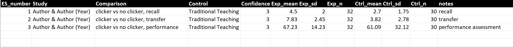

# Data Extraction and Coding {#data}

::: rmdimportant
**Preface to this chapter:** There are so many factors to account for while coding that it is impossible for me to say, "just do this" and you'll get the data you need. As such, this chapter will cover some major ideas, but you may need to refer to reviews in your area for more practical examples.
:::

## General Principles and Ideas

### Coding Forms

To this point we have identified our studies, and we now need to get the data out of our studies into a format we can use for data analysis. Typically I have used spreadsheets as my "coding form" where I store my data. I have used SPSS, Excel, and Google Sheets. Each has advantages and disadvantages. Recently, I've been using Google Sheets simply because it is easily accessible. I do not really find myself missing any features of other software platforms I've tried.

If you're conducting a meta-analysis, perhaps the most important consideration is that you can export to a file type that is usable with R. Personally I prefer to use .csv files as my data file that I import into R. Why? Because that is what the examples I found online used when I first learned R, and I’ve used it ever since.  

### Establishing Your Variables

Next you need to decide what information you want to extract from studies. This sounds daunting, there are so many possibilities! Well, this actually is pretty easy. Just look at your research questions - they should help you identify what information you need to extract from studies.

One very important factor is keeping a table of the variables you're coding. I like to create a table where the first column is the name of the variable, and the second column is an explanation of my coding scheme. Here is an example:

{width="100%"}

## Systematic Review Outcome Data Extraction

It is very difficult to provide guidance on how to set up your coding form for systematic reviews simply because there are *so* many different options. For example, do you want to know the fine-grained results, such as mean, standard deviations, and sample sizes? Or do you want to just know overall statistical test results? Or, maybe you only care about the conclusion the authors made based on those findings?

Regardless, you'll probably have key features you want to code from the studies. Depending on your research questions, these can vary widely. For example, you might be interested in publication trends, coding the year and type of publication. Or, you might be interested in the design of an intervention, coding features of the implementation. Or, you might be interested in the type of assessment used and code their qualities. Or, you might code all of these things. It really depends on your research questions. [Your research questions should guide the data you extract from studies.]{.underline}

## Meta-Analysis Outcome Data Extraction

Metafor[@viechtbauer2010] uses two pieces of information for conducting the meta-analysis that you need to consider during your coding process: the effect size (***yi***) and the variance (***vi***). As such, you have choices when coding: you can code the mean, standard deviation, and sample size for the experimental and control groups and then use R and metafor to calculate the effect size and variance for each comparison (my recommended method), or you can calculate the effect size and variance for each effect size yourself. I prefer the former approach because I find it helpful to have all of this data to check for errors in coding (such as a misplaced decimal point – these things happen!) and also for calculating sample sizes for tables.

If you choose to use R and metafor to calculate the effect sizes and variance, it will be important to have each mean, standard deviation, and sample size for the experimental group and the control group in their own columns (i.e., you'll need six columns to record this data). **The analysis codes in this book will assume this is the case.** I recommend having simple column titles that are descriptive, don't contain spaces, and are easy to remember, because you will have to type them into R.

Another important note I would like to make, because I see it so poorly reported in papers sometimes, is that [you should be very purposeful in your selection of comparison groups]{.underline}. Personally, I recommend that if given a choice (e.g., multiple control and/or experimental groups), you select the comparisons with the **fewest confounding variables.** Why? So you have more confidence that the effects you find are actually speaking to the intervention you're investigating rather than extraneous factors. If given a choice, I generally choose to ignore (that's right, I ignore data!) groups that present confounding variables when a non-confounded comparison is available. While that 'leaves data on the table' so to speak, it makes for a more trustworthy analysis (in my opinion). One key thing to remember with meta-analysis is that if you use junk data, you'll get a junk result. So more data isn't necessarily better than "cleaner" (less confounded) data.

### Conventional Meta-analysis

One key assumption of conventional meta-analysis is that of [statistical independence - each participant can only be counted once.]{.underline} Let's say you have a study that has three dependent variables, all of which are of interest to you - guess what, in conventional meta-analysis, you have to pick one dependent variable (or calculate weighted means and pooled standard deviations, but I do not prefer this method for reasons discussed in the [conventional meta-analysis chapter](#meta)). **Due to this, each comparison will appear on one row on your coding form.**

Let's look at some examples of different scenarios. Please note that you can have as many moderator variables as you wish, and they can be continuous or categorical.

Our first example is a study with one experiment and three groups: a control group, a group using clickers, and a group using clickers with self-reflection prompts. For the purposes of our example, we'll ignore the clicker with self-reflection prompts group, because a) we only have one control group, so we can only have one comparison or we violate the principle of statistical independence, and b) I don't like to combine groups for reasons discussed in the [conventional meta-analysis chapter](#meta). This means we'll compare the control group and the clicker group. We'll also code for two moderator variables, the type of control condition (categorical) and the student's confidence level using clickers (continuous). Our coding form may look like this:

::: rmdnote
{width="200%"}

*What's this mean?*

Labels in the "**Study**" column will appear on the forest plots, so check your spelling and formatting unless you want to fix it later. (Unsolicited advice: nobody wants to fix something like this later, just type it in correctly the first time).

**Comparison** in this case is used so that I know what group's data I coded and so readers know what data I coded.

**Control** is a categorical moderator. I would have set choices for this before starting coding.

**Confidence** is a continuous variable.

**Exp_mean** = mean of the experimental group

**Exp_sd** = standard deviation of the experimental group

**Exp_n** = sample size of the experimental group

**Ctrl_mean** = mean of the control group

**Ctrl_sd** = standard deviation of the control group

**Ctrl_n** = sample size of the control group

**Notes** = my own notes on the paper
:::

What if we have a study that has a design where there are two control groups (for our purposes) and two experimental groups? Well, luckily we can include all of them. Here's what that might look like if participants were split between low confidence and high confidence participants:

::: rmdnote
{width="200%"}

*What's this mean?*

Here you can see a few differences compared to the first example. Namely, in the study column I have separated the study names by adding an **'a'** and **'b'** to indicate that they are different comparisons in the same study.

Next, under "**comparison**" I indicated that one group was designated as the low confidence participants, and one was high confidence. Importantly - these are different participant groups with no overlap.
:::

That's basically it. The most important thing to remember when coding a conventional meta-analysis is that [**each participant can only be counted once.**]{.underline}

### Three-Level Meta-Analysis

As explained in the [three-level meta-analysis chapter](#3LMA), three-level meta-analysis can account for dependencies in the data. So, remember that example study with three dependent variables that were important? Well, if we use three-level meta-analysis we can include all of that data!

There are some important things we should note about how to structure your coding form. These are best seen through an example, so let's analyze an example coding form. Note that just like conventional meta-analysis, you can have as many moderator variables as you wish, and they can be continuous or categorical.

::: rmdnote
{width="200%"}

*What's this mean?*

**ES_number**: This column is unique to three-level meta-analysis. It should sequentially number every comparison in your coding form. There should not be duplicates.

**Study**: Similar to conventional meta-analysis, this should be the citation information as you want it to appear in your forest plot. However, [unlike conventional meta-analysis, here you want the study name to be identical across all comparisons (rows) of data from this study]{.underline}.

**Comparison**: Similar to conventional meta-analysis, this tells us what information we specifically examined. I indicated what type of outcome test this was from (i.e., recall, transfer, performance).

**Control**: This is a categorical moderator with pre-set categories.

**Confidence**: This is a continuous moderator. Note that it is the same for all comparisons because [these are the same participants across all three rows.]{.underline} This would be a huge violation of statistical independence in conventional meta-analysis, but that's why we're using three-level meta-analysis!

The rest of the columns are the same as in the conventional meta-analysis example.
:::

## Inter-rater Reliability or Agreement

You need to calculate inter-rater agreement or inter-rater reliability anytime you have more than one coder involved in the data extraction process. Even if you have one person coding the data, you should still have a second coder independently code a subset of the studies. Why? So you can find out a) if your first rater was accurate, b) if your coding scheme makes sense to another person, and c) to ensure your coding scheme is reliable. Generally speaking, I see 10-20% of the sample dual coded for inter-rater agreement or reliability purposes. 20% is what I would call "standard", while smaller percentages are occasionally used with larger reviews.

How do you calculate this? Well, it depends on what you are calculating. Many times I see a simple inter-rater agreement statistic reported as a percentage. This is OK. Cohen's kappa is another option if there are two raters. I've also seen correlation coefficients reported. What is most appropriate depends on your study and your data.

## Summary

The single most important consideration in your coding when coding for a meta-analysis is the selection of comparisons. You do not want to violate the principle of statistical independence in conventional meta-analysis, and you don't want to introduce confounding variables in any type of meta-analysis.
