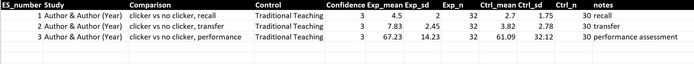
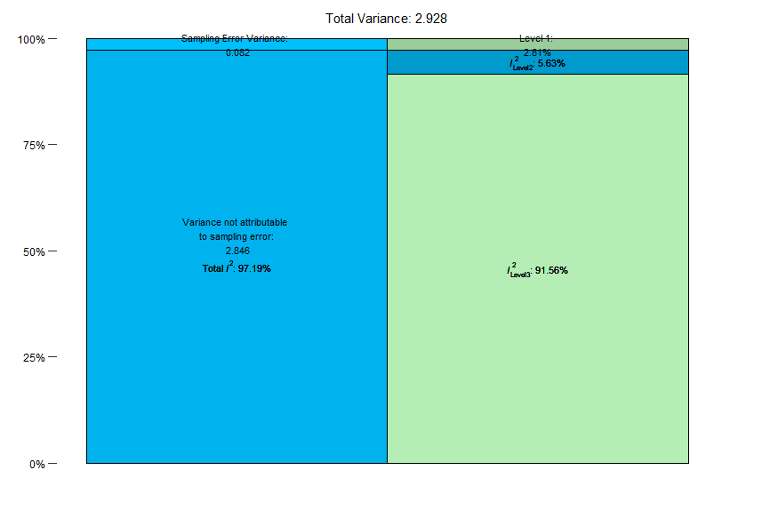
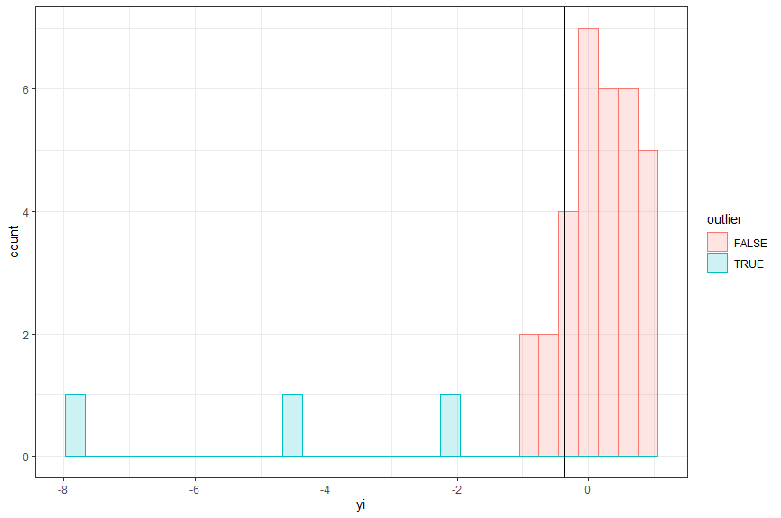
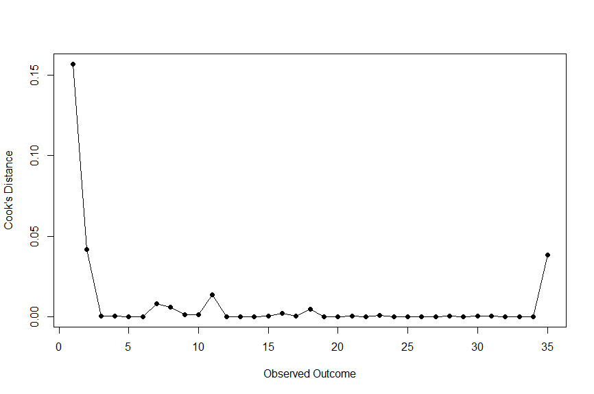
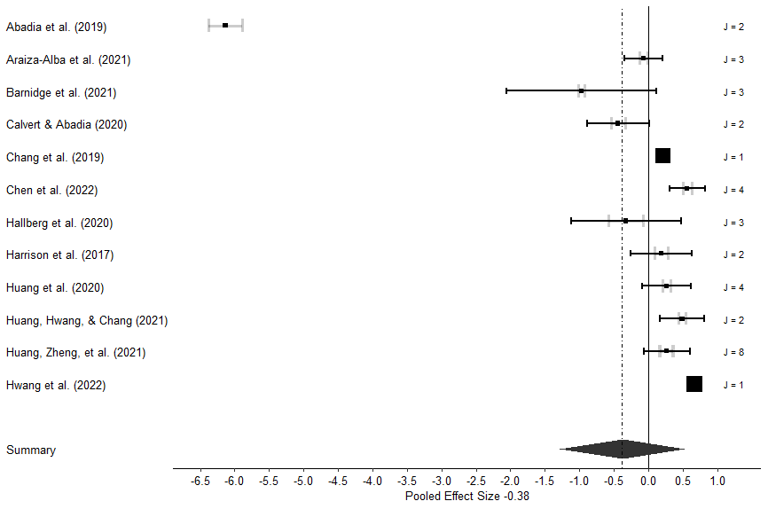
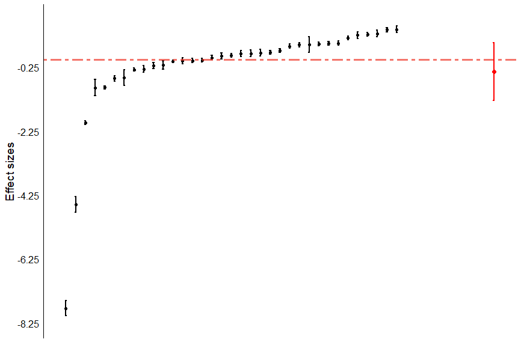
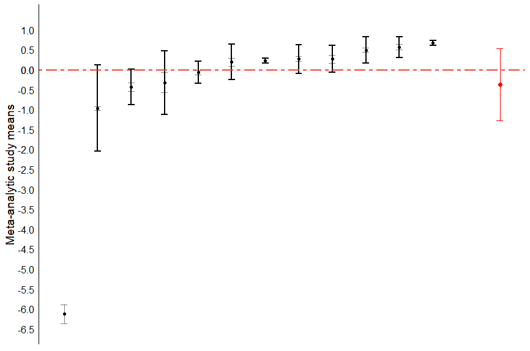
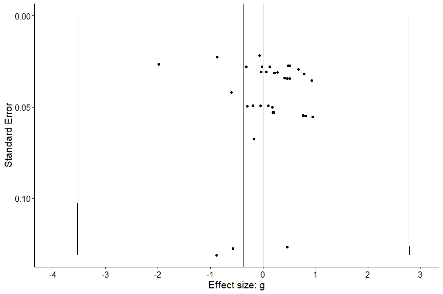
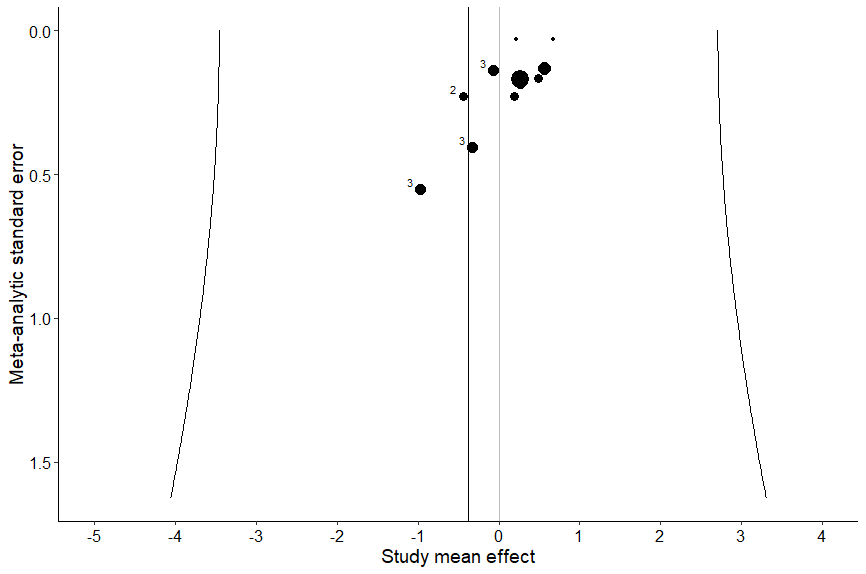

# Three-Level Meta-Analysis {#3LMA}

This chapter will cover the basics of three-level meta-analysis in R using metafor[@viechtbauer2010]. Remember how in conventional meta-analysis each participant can only be counted once? Well, that means we exclude A LOT of data when we use conventional meta-analysis in many education fields. But we can use three-level meta-analysis to get around that!

Let's look at an example: Say you are comparing the impact of learning from a virtual character to a game on learning outcomes. The study you're coding has two groups, a virtual character group and a game group. It has an immediate learning test, a one week delayed learning test, and a month delayed learning test. Which test do you code? In a three-level meta-analysis, you can code all three! No data lost, yay!

As noted in the conventional meta-analysis chapter, we're focusing on random-effects models here. If you don't know the differences between fixed and random effects meta-analysis models, please see [@borenstein2010].

If you aren't familiar with conventional meta-analysis, please read about it before conducting any meta-analysis. There are plenty of free resources available. I would recommend starting with the great, free book, [Doing Meta-Analysis in R](https://bookdown.org/MathiasHarrer/Doing_Meta_Analysis_in_R/)[@harrer2021]. This same book explains three-level meta-analysis quite well too!

Let's say you understand the differences between conventional and three-level meta-analytic models, you understand what meta-analysis is used for, and you've decided you're moving ahead with the three-level model. Let's explore how to do this in R with metafor using standardized mean differences as the effect size.

## Preparing your data

Hopefully you have already run your [literature search](#literaturesearch), [screened your studies](#screening), and [extracted your data](#data). This point forward assumes you have already completed these steps.

### Your Data File

Personally I prefer to use .csv files as my data file that I import into R. Why? Because that’s what was always used in the examples I found online when I was learning R, and I’ve used it ever since. Why change something that works? Plus, .csv works with many different software programs and across various operating systems.  

As noted in the [data extraction and coding chapter](#data), metafor uses two pieces of information for conducting the meta-analysis that you need to consider before importing data in R: the effect size (***yi***) and the variance (***vi***). If you read the previous chapters, you know you have choices when coding: you can code the mean, standard deviation, and sample size for the experimental and control groups and then use R and metafor to calculate the effect size and variance for each comparison (my recommended method), or you can calculate the effect size and variance for each effect size yourself. I prefer the former approach because I find it helpful to have all of this data to not only check for errors in coding (such as a misplaced decimal point – these things happen!) and also for calculating sample sizes for tables.

If you choose to use R and metafor to calculate the effect sizes and variance, it will be important to have each mean, standard deviation, and sample size for the experimental group and the control group in their own columns. I recommend having simple column titles that are descriptive and easy to remember, because you will have to type them into R. **See a sample coding form below that we will use to complete this analysis**. Note that you can have as many moderator variables as you wish, and they can be continuous or categorical.

::: rmdimportant
**Important Reminder:**

Preparing your data looks very similar to a conventional meta-analysis. However, it is important that you have two columns that are formatted in a specific way. First, you need a column that simply labels each comparison with a number that is not duplicative of any other comparison. In other words, you can simply code all your data, then create a new column and label each respective comparison as 1, 2, 3, 4, etc.

Second is the study column. It is important that every comparison from the same study appears the same. To avoid issues here, I recommend copy-pasting.

So in the end, your coding form may look like this, which contains three effect sizes from one study:

{width="200%"}

So, assuming you have all of that done, let's get onto the fun stuff, running a three-level meta-analysis!
:::

## Running a Three-Level Meta-Analysis in Metafor

### Example Data for This Analysis

If you want to follow along with this specific example, you'll want to use the subset of data from Schroeder et al.'s (2023)[@schroeder2023] meta-analysis on the effects of 360˚ video on learning. The data can be [downloaded here](https://github.com/noah-schroeder/reviewbook/blob/abfdb439ef81267b388ef75067a03262e1e59020/360%20sample%20data.csv).

### Load R Packages

First we need to load our R packages. Hopefully you installed these already, if not it won't take long, just see the [R Basics chapter](#rbasics). Assuming you have already installed the R packages, let's load them up so we can do some analysis!

::: rmdnote
``` r
###########################
#Preparation#
###########################

#load packages
library(metafor)
library(ggplot2)
library(dplyr)
```

*What's this code doing?*

This code is simply loading the metafor, ggplot2, and dplyr packages in the R environment so we can do our analysis.
:::

### Import Your Data Into R Studio

The first step to conducting your meta-analysis is to read in the data. To do that, we first want to set our working directory (more about that in the [R Basics chapter](#rbasics)). Once you've set your working directory and saved the sample data file there, you can use this piece of code.

::: rmdnote
``` r
#name data file and read in .csv.
df <- read.csv("360 sample data.csv")
```

*What's this code doing?\
*You see the first piece of code is '**df**', which is what we are going to name our data file. The **\<-** indicates that you are going to name something. The next piece is telling R to read in a .csv file from the working directory, and then you can see the file name I used. So basically, we're saying *import this data and call it df*.
:::

### Calculating Effect Sizes

Next, you will want to calculate the effect sizes and variance for each effect size if you have not done so already. You can do that using this code:

::: rmdnote
``` r
dat1 <- escalc(measure="SMD", m1i=Exp_mean, sd1i=Exp_sd, n1i=Exp_n,
               m2i=Ctrl_mean, sd2i=Ctrl_sd, n2i=Ctrl_n, data=df)
```

*What's this code doing?*

**dat1 \<-** indicates naming a new datafile and we're calling it **dat1**.

In this case you’re doing a calculation. **Escalc** is telling it calculate an effect size, **measure="SMD"** is saying we want the effect sizes to be standardized mean differences.

The next set of variables (**m1i, sd1i, n1i, m2i, sd2i,** and **n2i**) are specific pieces of information that metafor needs to calculate the effect size. **m1i** is the mean of the intervention group. **sd1i** is the standard deviation of the intervention group. **n1i** is the sample size of the intervention group. **m2i** is the mean of the control group. **sd2i** is the standard deviation of the control group. **n2i** is the sample size of the control group. I have always found those codes hard to remember, so on my coding form/data file I use different column headings. You can see I tell metafor where to find each variable by using the **=** sign. For example, the mean of the intervention group (**m1i**) is called **Exp_mean** in my data file.

Finally, we need to tell metafor where to find the data, and we have to refer to data already in R. We use our datafile '**df**'.
:::

Now you can make sure the effect size and variance for each effect size were calculated:

::: rmdnote
``` r
#display dataset with ES and variance
dat1
```

*What's this code doing?*

This will display your full data set saved as '**dat1**' in the console.
:::

However, I find this kind of hard to read if I have a lot of data. So, I prefer to write it all to a .csv file instead because I find it easier to read. This code can do that:

::: rmdnote
``` r
#save .csv file with ES data. This goes into working directory
write.csv(dat1, file = "ESdata.csv")
```

*What's this code doing?*

The **write.csv** tells R you want to create a .csv file. This will be saved in your working directory.

The **dat1** is telling R which data you want to write into the .csv file.

**File = "ESdata.csv"** is simply naming the datafile between the " ". You can name it whatever you want, but my example will use ESdata as the file name.
:::

You're probably wondering, *Why write a .csv file with the effect size and variance data when it is saved in R?*

Well, I like to look at the .csv file and make sure I don't see any effect sizes that seem very wrong. If I find any then it is easy for me to track back to which study it came from and I can see if I made a mistake during coding. A misplaced decimal point can have huge implications for your analysis - this is a step that helps you catch those human errors.

## Running The Meta-Analysis Model

Now the part we've all been waiting for, let's run a three-level meta-analysis model! We can use this code:

::: rmdnote
``` r
#multilevel model
m_multi <- rma.mv(yi,
                  vi,
                  random = ~ 1 | Study/ES_number,
                  method = "REML",
                  test = "t",
                  dfs = "contain",
                  data = dat1) 
m_multi
```

*What's this code doing?*

This looks scary doesn't it? It's not that complicated actually. Let's see what we're doing with this code.

First, we're naming our meta-analysis result as a new piece of data in R, and we're naming it '**m_multi**'

**rma.mv** is telling metafor that we want to run a random-effects, multivariate meta-analysis model. Within that, we're using **yi** to reference effect size data within our data set, **vi** to reference effect size variance within our data set.

The next line is a bit more complex. Harrer et al. (2021)[@harrer2021] explain that this is used to define the random effects and their nesting. Specifically, we will always start with **\~1 and a vertical bar** for three-level models. Next, we need to define what our grouping variables are, in our case, it's going to be studies (**Study** column in our data set), and within studies are effect size numbers (**ES_number** column in our data set).

**method** is specifying that we want to use Restricted Maximum-Likelihood.

**test**, by default, uses z. However Harrer et al. (2021)[@harrer2021] recommend using '**t**' because it is similar to the Knapp-Hartung method.

**dfs = "contain"** is done because using "residual" can lead to inflated Type 1 error rate according to Viechtbauer (n.d.)[@viechtbauer].

and **data = dat1** is simply telling metafor which data set within R to reference when running the analysis.

Finally, **m_multi** displays the analysis results on the screen.
:::

### Interpreting the Results

When we run that code, we now see the following:

::: rmdnote
``` r
Multivariate Meta-Analysis Model (k = 35; method: REML)

Variance Components:

            estim    sqrt  nlvls  fixed           factor 
sigma^2.1  2.6808  1.6373     12     no            Study 
sigma^2.2  0.1649  0.4061     35     no  Study/ES_number 

Test for Heterogeneity:
Q(df = 34) = 285.5500, p-val < .0001

Model Results:

estimate      se     tval  df    pval    ci.lb   ci.ub    
 -0.3799  0.4843  -0.7843  11  0.4494  -1.4459  0.6861    

---
Signif. codes:  0 ‘***’ 0.001 ‘**’ 0.01 ‘*’ 0.05 ‘.’ 0.1 ‘ ’ 1
```

*What's this mean?*

Recall this is a subset of data from Schroeder et al. (2023)[@schroeder2023] so the numbers will not align with what is in the published version.

The first line tells us this is a multivariate random-effects model including 35 comparisons, and tau^2^ was estimated using restricted maximum likelihood estimation (REML).

Next, we see our variance components. The estimate is tau^2^. The first (**sigma2.1**) refers to the between-study heterogeneity, whereas **sigma2.2** refers to within-comparison heterogeneity.

Typically, the other important pieces here that we are interested in reporting in our manuscript are the **overall effect size, tau^2^**, and the ***Q*****-test**.

The **effect size** (model results in this output) is interpreted as the standardized mean difference effect size, if there is a significant *Q* test it indicates there is significant heterogeneity in our sample.
:::

Next, let's check out the variance components in more depth.

### Explaining the Variance

In the above step, we saw tau^2^, but we did not see *I*^2^. If you're familiar with conventional meta-analysis, you know that *I*^2^ tells us how much variation is explained by between-study heterogeneity. In three-level meta-analysis we can look at this to find both a within-study and between-comparison value. Let's check out that code:

::: rmdnote
**Important:** First, we actually need to do some background work. Harrer et al. (2021)[@harrer2021] have provided code that helps us calculate *I*^2^,but first we need to 'teach' R that analysis.

So, please visit this link and copy the entire code: <https://raw.githubusercontent.com/MathiasHarrer/dmetar/master/R/mlm.variance.distribution.R>

Got the code? Great, go ahead and paste that into the R [console]{.underline} (where your results are usually displayed in R studio) and **hit enter.** Awesome, now R knows the analysis.
:::

Now we can use this code to calculate *I*^2^.

::: rmdnote
``` r
#calculate i2 for each level
i2 <- var.comp(m_multi)
summary(i2)
i2
```

*What's this code doing?*

We are creating a new object, **i2**, and using the function **var.comp** on our overall meta-analysis model (**m_multi**).

Then we calculate **summary** statistics for i2.

And finally display i2 on the screen.
:::

Let's look at the results:

::: rmdnote
``` r
$results
        % of total variance    I2
Level 1            2.805362   ---
Level 2            5.631495  5.63
Level 3           91.563144 91.56

$totalI2
[1] 97.19464
```

*What's this result mean?*

When you run this analysis, you'll see that 5.63% of the variance is due to level 2 (within-study) heterogeneity, while 91.56% is due to between-comparisons heterogeneity. Overall, the model explains 97.2% of the variance.
:::

We can also get the same information from the plot that was generated:

{width="100%"}

Ok, so we've established that we have quite a bit of between-comparison heterogeneity. When we consider that the tau^2^ for the between-comparison heterogeneity was notably higher than the within-study heterogeneity, these results are consistent and help us rationalize conducting moderator analyses.

### Checking for Outliers and Influence

At this point we've ran our random-effects three-level meta-analysis model. We also understand where the variance is coming from. However, we have not checked for outliers or studies with significant influence on the results. This is actually a complex topic, as not many meta-analyses (as of January, 2024) in education actually address a) if they searched for outliers or influence, b) what metric they used to check for outliers and why, and c) what they did about the outliers and why. Kind of interesting right?

So here's what we can do to check for outliers and influence. Unfortunately it isn't quite as easy as evaluating outliers in conventional meta-analysis, but don't worry, it's not too difficult!

First, let's check for outliers. We're going to slightly adapt Van Lissa's (n.d.)[@vanlissa] method.

::: rmdnote
``` r
#adapting CI calculation and plotting from https://cjvanlissa.github.io/Doing-Meta-Analysis-in-R/detecting-outliers-influential-cases.html
# Calculate CI for all observed effect sizes
dat1$upperci <- dat1$yi + 1.96 * sqrt(dat1$vi)
dat1$lowerci <- dat1$yi - 1.96 * sqrt(dat1$vi)
# Create filter variable
dat1$outlier <- dat1$upperci < m_multi$ci.lb | dat1$lowerci > m_multi$ci.ub
# Count number of outliers:
sum(dat1$outlier)
dat1
# Make a basic plot, based on the data in dat1, and specify that the x-variable is the effect size, 'd', the colour and fill of the histogram bars are based on
# the value of 'outlier':
ggplot(data = dat1, aes(x = yi, colour = outlier, fill = outlier)) +
  # Add a histogram with transparent bars (alpha = .2)
  geom_histogram(alpha = .2) +
  # Add a vertical line at the pooled effect value (m_re$b[1])
  geom_vline(xintercept = m_multi$b[1]) +
  # Apply a black and white theme
  theme_bw()

##Print file that lists outliers. This goes into working directory
write.csv(dat1, file = "outliers indicated.csv")
```

*What's this code doing?*

This code identifies outliers using the criteria that the individual effect size's confidence interval does not overlap the meta-analytical effect size confidence interval. It creates a nice chart that you'll see appear in your plots, and it will create a .csv file with outliers indicated.
:::

Running that code created a plot, a .csv file, and displayed data in the console. I prefer to first examine the plot, which shows three outliers in blue.

{width="100%"}

You can see here with have three outliers using this criteria, however we don't know which comparisons they are. Both the data in the console and generated .csv file tell us which comparisons were outliers.

At this point, similar to conventional meta-analysis, we need to examine the studies in more detail. First, I check for any data entry errors. Sometimes decimal points are in the wrong place, which can easy create an outlier.

#### Checking for Influence

Assuming there were no data entry errors, I then move on to check and see if these outliers have a significant influence on the results. Similar to conventional meta-analysis, we're going to examine Cook's distance, dfbetas, and hat values. You can read about influence diagnostics and the metrics used [here](https://wviechtb.github.io/metafor/reference/influence.rma.mv.html) and in Viechtbauer and Cheung (2010)[@viechtbauer2010b].Unfortunately, we're not using the nice influence code that provided asterisks on influential studies, so we'll have to a do a bit of work ourselves.

##### Cook's Distance

First, let's check out the Cook's distance.

::: rmdnote
``` r
#cook's distance
cooks <- cooks.distance(m_multi)
plot(cooks, type="o", pch=19, xlab="Observed Outcome", ylab="Cook's Distance")
```

*What's this code doing?*

This code calculates Cook's distance based on our overall meta-analysis result (**m_multi**).
:::

Running that code gives us the following plot:

{width="100%"}

Here, we are looking for a Cook's distance over 0.50 to indicate a study with significant influence. As shown, none of our outliers meet this criteria.

##### dfbetas

Now let's check our dfbetas. Here's the code:

::: rmdnote
``` r
#Calculate dfbetas
dfbetas <-dfbetas(m_multi)
dfbetas 
```

*What's this code doing?*

Here we are creating a **dfbetas** item, and using the **dfbetas** function on our meta-analytic model (**m_multi**).

We then display the results in the console.
:::

This gives us the following results:

::: rmdnote
``` r
        intrcpt
1  -0.626210184
2   0.169860526
3  -0.019773230
4   0.018578841
5   0.006064717
6   0.005999710
7  -0.089768522
8   0.075905014
9  -0.036595130
10  0.032405437
11  0.110392454
12 -0.004587048
13 -0.007298008
14 -0.001561507
15  0.021281904
16 -0.044837905
17 -0.019897092
18  0.067207219
19  0.003352683
20  0.007897610
21 -0.016373463
22  0.002410328
23  0.029562056
24 -0.010640162
25  0.009266463
26  0.005062508
27 -0.003420734
28  0.015525088
29 -0.007364825
30  0.012981876
31 -0.014656427
32  0.012061267
33 -0.011572638
34 -0.001067083
35  0.189468678
```

*What's this result mean?*

Here, we're looking for values more than the absolute value of 1. If those exist (none do in this data) we know that comparison has a significant influence on the results.
:::

##### Hat values

Finally we can check hat values to help us check for studies with significant influence on the overall meta-analytical result. We'll use this code:

::: rmdnote
``` r
#calculate hatvalues
hatvalues <- hatvalues(m_multi)
hatvalues
```

*What's this code doing?*

We are creating a data item called **hatvalues**, and calculating hat values using the **hatvalues** function in metafor for the overall meta-analytic model. We then display the results in the console.
:::

Running that code displays some statistics in the console, but honestly I find them challenging to read in that format. So instead, let's write all of our influence statistics into a .csv file for easier viewing.

::: rmdnote
``` r
##Print file that lists influence info to examine them. This goes into working directory
influence<-cbind(cooks, dfbetas, hatvalues)
write.csv(influence, file = "influenceinfo.csv")
```

*What's this code doing?*

First, we bind the cooks distance, dfbetas, and hatvalues data together into one data set, which we name **influence**.

Then we write this data into a .csv file that is saved in our working directory as **influenceinfo.csv**.
:::

So, how do we interpret hat values? This is a little more complex so that's why I like to use .csv files. As a reminder, you can read about influence diagnostics and the metrics used [here](https://wviechtb.github.io/metafor/reference/influence.rma.uni.html) and in Viechtbauer and Cheung (2010)[@viechtbauer2010b]. Specifically for hatvalues, we're looking for values larger than 3\*(p/k), where p is the number of model coefficients and k is the number of cases[@viechtbauera]. I like to do that computation in spreadsheet software, then have it highlight cells that exceed that value.

For our conversation here, we'll say that we did not find any individual comparisons that were influential. So what do we do? We have outliers, but none are influential? Let's explore that.

#### Dealing with Outliers and Influential Studies

We know from this data that three comparisons in our dataset are potential outliers, but they aren't significant. What do we do from here? Well, there's a lot of options, but here are my recommended steps:

-   Go back to your data and check the effect size. Is it oddly large or small? If so, check and see if you have a typo in the data.

-   Let's say the data has no errors. Next we'll look at the study itself. Is there something substantially methodologically 'wrong' or is it significantly different than the other studies in your sample? If so, you may be able to rationalize removing the study from your data set. If you do, be sure to report that you removed the study, and why, in your manuscript.

-   Ok so now things get real: Let's say your data is good, and the study itself was pretty well-done and not notably different than your other studies in the sample. What do you do? Well, that's a matter of opinion.

    -   My current personal opinion is to retain the study as is - because it is valid data.

    -   Another option is to "downsize" the effect size to slightly larger (or smaller) than the next largest (or smallest) effect size.

        -   I don't prefer this approach because I think valid data should be examined as valid data, but this is a reasonable option. The problem I have with this approach is that I have never seen a metric for how much "larger" or "smaller" you should change the effect size to. So I guess you just... guess? That seems imprecise to me and since it can/will influence your whole analysis, I don't like that.

    -   A final option is to remove the outlier from the dataset.

        -   I generally don't like this option because I cannot rationalize it if the study was consistent with the rest in the analysis.

For the purposes of this example, we'll assume that the data are good, and there was nothing particularly notable about the study itself. Therefore we will retain the effect size in the data.

### Writing up the Results

So if we were going to write this up, we may report something like this:

> We conducted a random-effects three-level meta-analysis of 35 comparisons extracted from 12 studies. Our results indicated that the intervention was not significantly different than the control condition (*g* = -.38, *p* = .45). The model indicates that there is significantly heterogeneity within the sample (*Q*(34) = 285.55, *p* \< .001), with tau^2^ = 2.68 (between-comparisons) and tau^2^ = .16 (within-studies). Furthermore, our model explained 97.20% of the variance, with 5.63% of the variance due to within-study heterogeneity, and 91.56% due to between-comparisons heterogeneity. We detected three comparisons that were potential outliers, however examination of the studies did not indicate any notable deviations from other studies in our sample. Furthermore, none of these potential outliers significantly influenced our overall meta-analytical result. As such, the potential outliers were retained in the data analysis.

### Moderator Analysis

We've ran our overall random-effects three-level meta-analysis model. Some people think this is the important finding, but in education, I think this result is generally only *kind of* interesting. The *really* good stuff, in my opinion, is examining all the potential moderator variables. Essentially, we're going to check and see what variables may influence the overall effect size.

What might be a moderator variable? Well, it depends on your field and the intervention you're investigating. In educational technologies, we typically examine participant characteristics, study characteristics, and intervention characteristics as potential moderators.

#### When are moderator analyses rationalized?

What a loaded question that is! In conventional meta-analysis, we're looking at the overall *Q* statistics *p* value, as well as *I^2^*. We're doing the same here in three-level meta-analysis.

So, now let's explore moderation analyses. We're going to focus on categorical moderators because there are a plethora of resources online about how to run numerical moderators in meta-regression.

::: rmdimportant
**Important Note:** Like conventional meta-analysis in metafor, the tricky thing about categorical variable moderator analyses is it's actually two steps, and they look similar. Let's take a look at the different steps.
:::

#### Calculate Q~between~

First we need to calculate Q~between~. This is an omnibus test that will tell us if there are significant differences between levels of the moderator. We're going to use grade range as our example:

::: rmdnote
``` r
####Grade Level  
#calculate qb
mod.gradeq <- rma.mv(yi,
                     vi,
                     data = dat1,
                     random = ~ 1 | Study/ES_number, 
                     method = "REML",
                     test = "t",
                     dfs = "contain",
                     mods = ~ factor(grade_c))
summary(mod.gradeq)
```

*What's this code doing?*

The first line is first creating a piece of data in R, which we're naming **mod.gradeq** (which to me, stands for moderator, grade, qbetween, but you can name it whatever you want).

Next you'll see the familiar **rma.mv** code, but the new piece is the '**mods = \~ factor(grade_c)**' piece. This is saying we want to run a moderator analysis with **grade_c** (that's the column name in our data set) as the moderator.

The second line simply displays the data on the screen.
:::

When we run that code, we're presented with the following:

::: rmdnote
``` r
Multivariate Meta-Analysis Model (k = 35; method: REML)

  logLik  Deviance       AIC       BIC      AICc   
-39.0955   78.1911   90.1911   98.7950   93.6911   

Variance Components:

            estim    sqrt  nlvls  fixed           factor 
sigma^2.1  2.9968  1.7311     12     no            Study 
sigma^2.2  0.1652  0.4064     35     no  Study/ES_number 

Test for Residual Heterogeneity:
QE(df = 31) = 255.8519, p-val < .0001

Test of Moderators (coefficients 2:4):
F(df1 = 3, df2 = 8) = 1.5686, p-val = 0.2711

Model Results:

                            estimate      se     tval  df    pval    ci.lb   ci.ub    
intrcpt                       0.2566  1.0087   0.2544   8  0.8056  -2.0695  2.5827    
factor(grade_c)Grades 9-12   -1.8710  1.2705  -1.4726  31  0.1509  -4.4623  0.7202    
factor(grade_c)University    -0.7356  1.1972  -0.6144  31  0.5434  -3.1773  1.7061    
factor(grade_c)Workforce      0.4138  2.0591   0.2010   8  0.8457  -4.3345  5.1621    

---
Signif. codes:  0 ‘***’ 0.001 ‘**’ 0.01 ‘*’ 0.05 ‘.’ 0.1 ‘ ’ 1
```

*What's this result mean?*

There's a lot of information here but we only want one thing: **The test of moderators.** In this case, that's Test of Moderators (coefficients 2:4): F(df1 = 3, df2 = 8) = 1.57, p-val = 0.27

What we're doing here is checking the **p value**. We can see this test is not significant, which means that this is not a statistically significant moderator. In other words, for this example, the effect of the intervention was not significantly different for participants in grades 9-12 than participants in post-secondary education.
:::

With our Q~between~ value in hand, we now need to create the actual table we'll report in the manuscript. You'll note that when we calculated Q~between~, one of the levels of the moderator was missing, and replaced by the term intercept. Well, it's time to fix that and get the tables we would use for reporting in our manuscript.

We'll use a very similar code:

::: rmdnote
``` r
#calculate ES
mod.grade <- rma.mv(yi,
                    vi,
                    data = dat1,
                    random = ~ 1 | Study/ES_number, 
                    method = "REML",
                    test = "t",
                    dfs = "contain",
                    mods = ~ factor(grade_c)-1)
summary(mod.grade)
```

*What's this code doing?*

The first line is first creating a piece of data in R, which we're naming **mod.grade** (which to me, stands for moderator, grade, but you can name it whatever you want). Next you'll see the familiar **rma.mv code**, and the '**mods = \~ factor(grade_c)**' piece. This is saying we want to run a moderator analysis with **grade_c** (that's the column name in our data set) as the moderator. What's new here is the **-1**, which [removes the intercept and runs an ANOVA type model]{.underline} that we're used to seeing for categorical variables in educational meta-analyses.

The second line simply displays the data on the screen.
:::

When we run that code, we'll get our results, which look like this:

::: rmdnote
``` r
Multivariate Meta-Analysis Model (k = 35; method: REML)

  logLik  Deviance       AIC       BIC      AICc   
-39.0955   78.1911   90.1911   98.7950   93.6911   

Variance Components:

            estim    sqrt  nlvls  fixed           factor 
sigma^2.1  2.9968  1.7311     12     no            Study 
sigma^2.2  0.1652  0.4064     35     no  Study/ES_number 

Test for Residual Heterogeneity:
QE(df = 31) = 255.8519, p-val < .0001

Test of Moderators (coefficients 1:4):
F(df1 = 4, df2 = 8) = 1.3172, p-val = 0.3420

Model Results:

                            estimate      se     tval  df    pval    ci.lb    ci.ub    
factor(grade_c)Grades 4-6     0.2566  1.0087   0.2544   8  0.8056  -2.0695   2.5827    
factor(grade_c)Grades 9-12   -1.6145  0.7725  -2.0899  31  0.0449  -3.1900  -0.0389  * 
factor(grade_c)University    -0.4790  0.6448  -0.7429  31  0.4631  -1.7941   0.8360    
factor(grade_c)Workforce      0.6704  1.7951   0.3734   8  0.7185  -3.4691   4.8099    

---
Signif. codes:  0 ‘***’ 0.001 ‘**’ 0.01 ‘*’ 0.05 ‘.’ 0.1 ‘ ’ 1
```

*What's this result mean?*

This looks almost identical to the previous result when we calculated Q~between~. However, you'll note that the intercept is now gone. [These are the means, standard errors, p values, etc. for the levels of the moderator that you will want to report in your manuscript.]{.underline}

Note that the test of moderators is different than before. Confusing right? [Well, that's because the two tests, while named the same thing, are testing different things.]{.underline} When we calculated Q~between,~ the test of moderators was testing if there were significant differences between levels of the moderator. However, in this test of moderators it is testing if the moderators are significantly different than zero. These are totally different tests - **do not use this test of moderator as your Q~between~ value because it most certainly is not!**
:::

What if you have more moderator variables to test? Well, you simply replace the '**grade_c**' variable with whatever each moderator variable column in your data is labeled as, and don't forget to rename the data items as well (**mod.gradeq** and **mod.grade**). Then you can re-run the same two code sets to calculate Q~between~ and the effect sizes.

#### Easily Create Tables

Have you tried to copy-paste the results of the moderator analysis from the console into a word processing software yet? Go ahead and try, the book will be here while you test it out.

So you tried it, and that looks terrible right? And the tables are missing data reviewers want to see, like the number of participants per level of moderator. What if I told you that Chris Palaguachi and I have already spent time creating the code to create these tables? Let's take a look at the code that will save you hours and hours of calculations and table manipulations.

##### Create the Summary Table

First we'll create the summary table. This is way easier than it sounds.

::: rmdnote
``` r
#Only save table results for word 
mod.grade_table <-coef(summary(mod.grade))
```

*What's this code doing?*

First, we're creating a new data item, called **mod.grade_table**. The **coef(summary(mod.grade))** is simply telling metafor we want the coefficient summary for the **mod.grade** data - which is what we called our moderator analysis of the grade levels.

Overall, this basically saves most of the data we want as a separate table.
:::

So now we have a beautiful summary table. We could write this to a spreadsheet now... but what about the number of participants in each condition for each level of the moderator? And what about the number of comparisons for each moderator? We could hand calculate those... but that sounds boring. We could program in the analyses individually... but that is also boring (I've done that more than I want to admit). Or, we can use this code Chris and I created to do that automatically:

##### Calculating Participant and Comparison Numbers, and Saving the Table

First, we'll compute the number of participants from the experimental and control conditions for each level of the moderator. We'll also calculate the number of comparisons for each level of the moderator. Finally, we'll bind these to the pre-existing table, and write all of this information as a table in a .csv file.

::: rmdnote
``` r
#calculate participants in each group and add it to the table
mod.gradeSumParticipants <- dat1 %>%
  group_by(grade_c) %>%
  summarise(nexp = sum(Exp_n, na.rm = TRUE),
            nctrl = sum(Ctrl_n, na.rm = TRUE))
mod.gradeNumComp <- dat1 %>%
  count(grade_c)
mod.gradeNumComp <- rename(mod.gradeNumComp, kcomparisons = n)
mod.grade_table.final<- cbind(mod.gradeSumParticipants,mod.gradeNumComp[c(2)], mod.grade_table) 
write.csv(mod.grade_table.final, "mod.gradeResult.csv")
```

*What's this code doing?*

There's a lot more going on in this code, so we'll look at major pieces.

First, we create a new data item called **gradeSumParticipants**. This data is counting the number of participants in the experimental and control conditions, and naming them **nexp** and **nctrl**, respectively.

Next, we have a new item called **gradeNumComp**. This is counting the number of comparisons in each item. We then create a new data item (**gradeNumComp**) and rename it **kcomparisons**.

Finally, we create a new table, bind all the data together, and write it as a csv file.
:::

How great is that? We now have almost all the data we need from the moderator analysis. The only missing piece is the *Q~between~* value. Guess what, we have a script to record that too.

::: rmdnote
``` r
# Save QM Test and write it into a text file
Qmod.grade_collapsed_string <- paste(mod.gradeq[["QMdf"]], collapse = ", ")
Qmod.grade1 <- data.frame(CollapsedQMdf = Qmod.grade_collapsed_string)
Qmod.grade2 <- round(mod.gradeq$QM,2)
Qmod.grade3 <- round(mod.gradeq$QMp,3)

Qmod.gradeQ <- paste(
  "Qb(",Qmod.grade_collapsed_string,") =", 
  Qmod.grade2,
  ", p =", 
  Qmod.grade3,
  collapse = " "
)

cat(Qmod.gradeQ, "\n")
mod.gradeQtest <- data.frame(Text = Qmod.gradeQ)
write.table(mod.gradeQtest, file = "Qmod.gradeQ.txt", row.names = FALSE, col.names = FALSE, quote = FALSE)
```

*What's this code doing?*

This is another complex code. First, we are extracting some data from the moderator analysis (The relevant *Q* statistics) and naming them something else.

Then we are writing them into the format we want.

Then we write them into a .txt file in the format we should be used to seeing for *Q~between.~*
:::

Ok, so now we've gotten our moderator analyses run and all of our information extracted. We can simply replicate this code, changing our moderator names and variable names where required. You should also change the name of the file being written. I like to make it the same as the moderator name to minimize confusion later. I recommend having a copy of the code for each variable, and using find and replace to replace the moderator names. It's quite efficient!

## Plots

We should always include a forest plot with our results. Unfortunately, this is a bit more complex with a three-level meta-analysis because we have both study-level effects and (often) multiple comparisons from within each study. However, there are some really fun visualizations we can create if we borrow some code from others. Let's see what's possible.

::: rmdnote
**Important Note:** We're going to use a different file for creating our forest and caterpillar plots. This same file and data preparation is needed to create the funnel plots to evaluate publication bias. For that reason, I tend to create my forest plots, caterpillar plots, and funnel plots all at the same time. In addition, because it uses a different data file, I generally create a second R code file as well specifically for making plots. That's why this all grouped at the end of this chapter.
The code in this plots section is adapted from Fernández-Castilla et al. (2020)[@fernández-castilla2020]. I have slightly adapted the code to fit our data.
:::

#### Preparatory Work

Before we dig into the 'how-to' of creating forest plots for three-level meta-analysis, we need to create a new data file with our raw data and compute a couple new statistics. So let's do that first.

We'll need a .csv file that contains columns for outcome number (this is just sequential, meaning 1 through *n* number of comparisons). Next, we need a study column, this will number the studies (*not* comparisons, but studies). Then we need author names as we wish to see them on the plots. Next we have effect size, variance, and standard error.

So what does this mean practically? Well, for me, it usually means I copy-paste the author list from my data sheet, as well as the effect size and variance.

That leaves one tricky variable... standard error. We don't have that in our data set currently. Do you remember the relationships between the standard error, participant numbers, and the variance? This is basic statistics stuff right?

Don't worry, I didn't remember either. The standard error is the computed by dividing the standard deviation by the square root of the sample size.

If you recall, we already have sample sizes coded. So what I do is copy-paste my experimental and control group participant numbers, then sum them for each comparison.

Now we just need to calculate that standard deviation. Well, the standard deviation is the squareroot of the variance, and we know the variance. So that's easy to compute in our spreadsheet.

Together, these data points let us compute the standard error in our spreadsheet.

In the end, your [spreadsheet should look like this one](https://github.com/noah-schroeder/reviewbook/blob/abfdb439ef81267b388ef75067a03262e1e59020/data%20for%20plots.csv), which is what we'll use for creating our plots.

Now, let's get to the R code and load up our data

::: rmdnote
``` r
#load packages
library(ggplot2)
library(plyr)
library(grid)
library(gridExtra)
library(metafor)
library(metaSEM)
library(ggrepel)

#load data
mydf<-read.csv("data for plots.csv")


study<-mydf$study
out<-mydf$outcome
ES<-mydf$effect_size
var<-mydf$variance
se<-mydf$standard_error
author<-mydf$author
```

*What's this code doing?*

First, we load our packages.

Next, we import our data from the working directory. I call this file "**data for plots**" because I'm really creative.

Next we are naming a bunch of vectors we'll need to create these plots and our publication bias plots.
:::

#### Three-Level Meta-Analysis Forest Plot

Let's create our three-level forest plot:

::: rmdnote
``` r
forest_plot_3<-function(author, study, ES, out, var, se, size_lines){
  size_lines=size_lines
  dataset<-data.frame(study,author, ES, out, var, se)
  row = 1
  nrow=max(dataset$study)
  studyn=max(dataset$study)
  studyinfo = data.frame(Study = numeric(nrow),
                         author = numeric(nrow),
                         id = numeric(nrow),
                         ES= numeric(nrow),
                         SE= numeric(nrow),
                         Var=numeric(nrow),
                         cilb= numeric(nrow),
                         ciub= numeric(nrow),
                         k= numeric(nrow),
                         out=numeric(nrow),
                         median_Var=numeric(nrow),
                         S_cilb=numeric(nrow),
                         S_ciub=numeric(nrow),
                         Weight=numeric(nrow))
  Study1 =c()
  Study2 =c()
  dataset$author<-as.character(dataset$author)
  meta_abu <- summary(meta3(y=ES, v=var, cluster=study, data=dataset))
  estimate<-round(meta_abu$coefficients$Estimate[1], digits=2)
  tau<-meta_abu$coefficients$Estimate[3]
  out<-meta_abu$coefficients$Estimate[2]
  
  
  
  for (i in 1:max(dataset$study)){
    data<-subset(dataset, study==i)
    uni=nrow(data)
    
    if (uni==1) {
      studyinfo$ES[row]<-data$ES
      studyinfo$SE[row]<-data$se
      studyinfo$cilb[row]<-(data$ES-(data$se*1.96))
      studyinfo$ciub[row]<-(data$ES+(data$se*1.96))
      studyinfo$S_cilb[row]<-(data$ES-(data$se*1.96))
      studyinfo$S_ciub[row]<-(data$ES+(data$se*1.96))
      studyinfo$Weight[row]<-1/ (data$se^2)
    }
    else {
      a<-rma(y=data$ES, vi=data$var, data=data, method="REML")
      
      diagonal<-1/(data$var+out)
      D<-diag(diagonal)
      obs<-nrow(data)
      I<-matrix(c(rep(1,(obs^2))),nrow=obs)
      M<-D%*%I%*%D
      inv_sumVar<-sum(1/(data$var+out))
      O<-1/((1/tau)+inv_sumVar)
      V<-D-(O*M)
      T<-as.matrix(data$ES)
      X<-matrix(c(rep(1,obs)), ncol=1)
      var_effect<-solve(t(X)%*%V%*%X)
      
      studyinfo$ES[row]<-a$b
      studyinfo$SE[row]<-a$se
      studyinfo$cilb[row]<-a$ci.lb
      studyinfo$ciub[row]<-a$ci.ub
      studyinfo$S_cilb[row]<-a$b - 1.96*median(data$se)
      studyinfo$S_ciub[row]<-a$b + 1.96*median(data$se)
      studyinfo$Weight[row]<-1/ var_effect
    }
    
    studyinfo$Study[row]<-c(Study1,paste("Study",i))
    studyinfo$id[row]<-i
    studyinfo$k[row]<-nrow(data)
    studyinfo$author[row]<-data$author[1]
    studyinfo$out[row] <- c(Study2, paste("J =",studyinfo$k[i]))
    studyinfo$median_Var[row]<-median(data$var)
    studyinfo$Var<-(studyinfo$SE)^2
    row = row + 1      
  }
  
  
  minimum<-min(studyinfo$S_cilb)
  maximum<-max(studyinfo$S_ciub)
  lim_minimum<-minimum-0.10
  lim_maximum<-maximum+0.25
  r_lim_minimum<-round(lim_minimum, digits=0)
  r_lim_maximum<-round(lim_maximum, digits=0)
  abs_r_lim_minimum<-abs(r_lim_minimum)
  abs_r_lim_maximum<-abs(r_lim_maximum)
  dec_min<-round(abs((lim_minimum-r_lim_minimum)*100), digits=0)
  dec_max<-round(abs((lim_maximum-r_lim_maximum)*100), digits=0)
  
  if (dec_min < 25) {
    c=25/100
  } else if (dec_min>25 & dec_min<50) {
    c=50/100
  } else if (dec_min>50 & dec_min<75) {
    c=75/100
  } else {
    c=abs_r_lim_minimum+1
  }
  
  if (dec_max < 25) {
    d=25/100
  } else if (dec_max>25 & dec_max<50) {
    d=50/100
  } else if (dec_max>50 & dec_max<75) {
    d=75/100
  } else {
    d=abs_r_lim_maximum+1
  }
  
  lim_minimum<-r_lim_minimum-c
  lim_maximum<-r_lim_maximum+d
  
  Axis_ES <- seq(lim_minimum, lim_maximum, by=0.50)
  Axis_ES<-Axis_ES[order(Axis_ES)]
  empty <- data.frame(id=c(NA,NA), ES=c(NA, NA), cilb=c(NA, NA),ciub=c(NA,NA),
                      k=c(NA,NA), Study=c(NA,NA), SE=c(NA, NA), 
                      out=c(NA,NA),median_Var=c(NA,NA), S_cilb=c(NA,NA), S_ciub=c(NA,NA),
                      Var=c(NA, NA), Weight=c(NA,NA), author=c("","Summary"))
  
  studyinfo <- rbind(studyinfo, empty)
  studyinfo$Study=factor(studyinfo$Study ,levels=unique(studyinfo$Study))
  studyinfo$author=factor(studyinfo$author ,levels=unique(studyinfo$author))
  r_diam<-studyn-2
  sum.y <- c(1, 0.7, 1, 1.3, rep(NA,r_diam )) 
  sum.x <- c(meta_abu$coefficients$lbound[1], meta_abu$coefficients$Estimate[1], meta_abu$coefficients$ubound[1], meta_abu$coefficients$Estimate[1], rep(NA, r_diam))
  studyinfo<-data.frame(studyinfo, sum.x, sum.y )
  studyinfo<-studyinfo[, c(15,16,3,4,5,6,7,8,9,10,11,12,13,14,1,2)]
  
  forest<-ggplot()+ geom_point(data=studyinfo, aes(y=factor(author), x = ES, xmin =cilb, xmax = ciub, size=Weight), shape=15) +
    #scale_size_area()+
    geom_errorbarh(data=studyinfo, aes(y=factor(author), x = ES, xmin =cilb, xmax = ciub), size=1, height=.2)+
    scale_x_continuous(limits=c(lim_minimum,lim_maximum),breaks=Axis_ES)+ 
    scale_y_discrete(limits=rev(levels(studyinfo$author)))+
    geom_vline(xintercept=0)+
    theme(panel.grid.major = element_blank(),
          panel.grid.minor = element_blank(),
          legend.position="none",
          panel.background = element_blank(),
          axis.line.x = element_line(colour = "black"),
          axis.ticks.y =element_blank(),
          axis.title.x=element_text(size=10, color ="black",family="sans"),
          axis.title.y=element_blank(),
          axis.text.y = element_text(family="sans",size=10, color = "black",hjust=0, angle=0),
          axis.text.x = element_text(size=10, color="black",family="sans"), 
          axis.line.y =element_blank())+
    labs(x = paste("Pooled Effect Size", estimate), hjust=-2)+
    geom_polygon(aes(x=sum.x, y=sum.y))+
    geom_vline(xintercept=estimate, colour="black",linetype=4)+
    geom_text(aes(x=lim_maximum, y=factor(studyinfo$author),label = studyinfo$out), size=3)
 
  if (size_lines==1){
   
  forest<-forest+geom_point(data=studyinfo, aes(y=factor(author), x=ES, xmin = S_cilb, xmax =  S_ciub), shape=15)+
    geom_errorbarh(data=studyinfo, aes(y=factor(author), x=ES, xmin = S_cilb, xmax =  S_ciub, size=k), width=.8,  height=.4, alpha=.2) #Cambiar .3 por .8
  } else{
    
    forest<-forest+geom_point(data=studyinfo, aes(y=factor(author), x=ES, xmin = S_cilb, xmax =  S_ciub), shape=15)+
      geom_errorbarh(data=studyinfo, aes(y=factor(author), x=ES, xmin = S_cilb, xmax =  S_ciub), width=.8,  height=.4, alpha=.5) #Cambiar .3 por .8
    
  }
  print(forest)

}


##If we want the size of the grey lines to be proportional to the number of outcomes within each study, then size_lines=1
##otherwise, specify that size_lines=0

forest_plot_3(author, study, ES, out, var, se, size_lines=1)
```

*What's this code doing?*

Well, there is a lot going on here, and I do not understand all of it. But what we're doing is making the beautiful three-level meta-analysis funnel plot seen below.
:::

If this code works correctly for you, the forest plot should appear in the plots section of R studio.

{width="100%"}

Absolutely beautiful plot right? You can read about what the different items and colors mean in Fernández-Castilla et al. (2020)[@fernández-castilla2020]. Remember, all of the code for the plots in this chapter are from their paper. But to quickly explain some major points, the black boxes represent the average effect size from the comparisons within each study, and the black lines are the study precision. The grey lines are the median precision of one effect size from each study. The size of the effect size box is representative of its weight in the analysis. J represents how many comparisons were analyzed from each study.

#### Caterpillar Plots

While forest plots are great, sometimes we want a different way to visualize our data. Caterpillar plots are an interesting way to visualize our data. Again, we borrow some code from Fernández-Castilla et al. (2020)[@fernández-castilla2020].

##### All Comparisons

First, let's look at all comparisons in one plot:

::: rmdnote
``` r
Caterpillar<-function(study, ES, out, var, se){ 
  dataset<-data.frame(study, ES, out, var, se)
  dataset$cilb<-dataset$ES-(1.96*dataset$se)
  dataset$ciub<-dataset$ES+(1.96*dataset$se)
meta_abu <- summary(meta3(y=ES, v=var, cluster=study, data=dataset))
dataset<-dataset[order(dataset$ES),]
dataset$id<-c(rep(1:length(dataset$se)))
P_combined<-nrow(dataset)+10
combined_ES<-data.frame(ES=meta_abu$coefficients$Estimate[1],
                        cilb=meta_abu$coefficients$lbound[1], ciub=meta_abu$coefficients$ubound[1],
                        id=P_combined)


minimum<-min(dataset$cilb)
maximum<-max(dataset$ciub)
lim_minimum<-minimum-0.10
lim_maximum<-maximum+0.10
r_lim_minimum<-round(lim_minimum, digits=0)
r_lim_maximum<-round(lim_maximum, digits=0)
abs_r_lim_minimum<-abs(r_lim_minimum)
abs_r_lim_maximum<-abs(r_lim_maximum)
dec_min<-round(abs((lim_minimum-r_lim_minimum)*100), digits=0)
dec_max<-round(abs((lim_maximum-r_lim_maximum)*100), digits=0)

if (dec_min < 25) {
  c=25/100
} else if (dec_min>25 & dec_min<50) {
  c=50/100
} else if (dec_min>50 & dec_min<75) {
  c=75/100
} else {
  c=abs_r_lim_minimum+1
}

if (dec_max < 25) {
  d=25/100
} else if (dec_max>25 & dec_max<50) {
  d=50/100
} else if (dec_max>50 & dec_max<75) {
  d=75/100
} else {
  d=abs_r_lim_maximum+1
}

lim_minimum<-r_lim_minimum-c
lim_maximum<-r_lim_maximum+d

Axis_ES <- seq(lim_minimum, lim_maximum, by=2)
#Axis_ES<- c(Axis_ES,0)
Axis_ES<-Axis_ES[order(Axis_ES)]

p <- ggplot()+
  geom_point(data=dataset, aes(y=id, x=ES),colour = "black")+
  geom_errorbarh(data=dataset, aes(y=id, x=ES, xmin = cilb, xmax = ciub),size=1,  height=.2)+
  scale_x_continuous(limits=c(lim_minimum,lim_maximum),breaks=Axis_ES)+ 
  geom_vline(xintercept=0,size=1.2, alpha=0.7,colour="#EF3B2C", linetype="twodash")
p<-p+
  geom_point(data=combined_ES, aes(y=id, x=ES), colour = "red", size=2)+
  geom_errorbarh(data=combined_ES, aes(y=id, x=ES, xmin = cilb, xmax = ciub), colour="red", size=1,  height=.2)+
  coord_flip()+
  theme( axis.line=element_blank(), panel.grid.major = element_blank(), panel.grid.minor = element_blank(),
         legend.position="none",panel.background = element_blank(), axis.line.x = element_blank(), axis.line.y = element_line(colour = "black"),
         axis.title.x=element_blank(), axis.title.y=element_text(size=14), axis.text.y = element_text(size=12, color="black"), axis.text.x = element_blank(), axis.ticks = element_blank())+
  xlab("Effect sizes")

print(p)

}
Caterpillar(study, ES, out, var, se)
```

*What's this code doing?*

This code creates a caterpillar plot of all comparisons in the analysis.
:::

That should create a plot like this:

{width="100%"}

As you can see, all 35 comparisons are included in this plot, listed from smallest (left) to largest (right). The red line is our overall meta-analytic effect size.

##### Study-Level Plot

If you prefer a plot of study-level results, similar to the forest plot, we can use this code, again from Fernández-Castilla et al. (2020)[@fernández-castilla2020]:

::: rmdnote
``` r

caterpillar_studies<-function(study, ES, out, var, se){
dataset<-data.frame(study, ES, out, var, se)
  meta_abu <- summary(meta3(y=ES, v=var, cluster=study, data=dataset))
  row = 1
  nrow=max(dataset$study)
  studyn=max(dataset$study)
  studyinfo = data.frame(Study = numeric(nrow),
                         ES= numeric(nrow),
                         SE= numeric(nrow),
                         cilb= numeric(nrow),
                         ciub= numeric(nrow),
                         S_cilb=numeric(nrow),
                         S_ciub=numeric(nrow))
  Study1 =c()
  Study2 =c()
  
  for (i in 1:max(dataset$study)){
    data<-subset(dataset, study==i)
    uni=nrow(data)
    if (uni==1) {
      studyinfo$ES[row]<-data$ES
      studyinfo$SE[row]<-data$se
      studyinfo$cilb[row]<-(data$ES-(data$se*1.96))
      studyinfo$ciub[row]<-(data$ES+(data$se*1.96))
      studyinfo$S_cilb[row]<-(data$ES-(data$se*1.96))
      studyinfo$S_ciub[row]<-(data$ES+(data$se*1.96)) 
    }
    
    else {
    a<-rma(y=data$ES, vi=data$var, data=data, method="REML")
    studyinfo$ES[row]<-a$b
    studyinfo$SE[row]<-a$se
    studyinfo$cilb[row]<-a$ci.lb
    studyinfo$ciub[row]<-a$ci.ub
    studyinfo$S_cilb[row]<-a$b - 1.96*median(data$se)
    studyinfo$S_ciub[row]<-a$b + 1.96*median(data$se)
    }
    studyinfo$Study[row]<-c(Study1,paste("Study",i))
    row = row + 1      
    
  }
  
  studyinfo<- studyinfo[order(studyinfo$ES),]
  studyinfo$id<-c(rep(1:length(studyinfo$ES)))
  
  P_combined<-nrow(studyinfo)+2
  combined_ES<-data.frame(ES=meta_abu$coefficients$Estimate[1],
                          cilb=meta_abu$coefficients$lbound[1], ciub=meta_abu$coefficients$ubound[1],
                          id=P_combined)
  
  
  minimum<-min(studyinfo$S_cilb)
  maximum<-max(studyinfo$S_ciub)
  lim_minimum<-minimum-0.10
  lim_maximum<-maximum+0.10
  r_lim_minimum<-round(lim_minimum, digits=0)
  r_lim_maximum<-round(lim_maximum, digits=0)
  abs_r_lim_minimum<-abs(r_lim_minimum)
  abs_r_lim_maximum<-abs(r_lim_maximum)
  dec_min<-round(abs((lim_minimum-r_lim_minimum)*100), digits=0)
  dec_max<-round(abs((lim_maximum-r_lim_maximum)*100), digits=0)
  
  if (dec_min < 25) {
    c=25/100
  } else if (dec_min>25 & dec_min<50) {
    c=50/100
  } else if (dec_min>50 & dec_min<75) {
    c=75/100
  } else {
    c=abs_r_lim_minimum+1
  }
  
  if (dec_max < 25) {
    d=25/100
  } else if (dec_max>25 & dec_max<50) {
    d=50/100
  } else if (dec_max>50 & dec_max<75) {
    d=75/100
  } else {
    d=abs_r_lim_maximum+1
  }
  
  lim_minimum<-r_lim_minimum-c
  lim_maximum<-r_lim_maximum+d
  
  Axis_ES <- seq(lim_minimum, lim_maximum, by=0.50)
  Axis_ES<- c(Axis_ES,0)
  Axis_ES<-Axis_ES[order(Axis_ES)]
  
  
  r <- ggplot()+
    geom_point(data=studyinfo, aes(y=id, x=ES),colour = "black")+
    geom_errorbarh(data=studyinfo, aes(y=id, x=ES, xmin = cilb, xmax = ciub),  size=1, height=.2)+
    scale_x_continuous(limits=c(lim_minimum,lim_maximum),breaks=Axis_ES)+ 
    geom_vline(xintercept=0,size=1.2, alpha=0.7,colour="#EF3B2C", linetype="twodash")
  
  r<-r + geom_point(data=studyinfo, aes(y=id, x=ES),colour = "black")+
    geom_errorbarh(data=studyinfo, aes(y=id, x=ES, xmin = S_cilb, xmax =  S_ciub),width=.2,  height=.2, alpha=.5)+
    geom_point(data=combined_ES, aes(y=id, x=ES),colour = "red", size=2)+
    geom_errorbarh(data=combined_ES, aes(y=id, x=ES, xmin = cilb, xmax =ciub),height=.2, colour = "red")+
    coord_flip()+
    theme(axis.line=element_blank(), panel.grid.major = element_blank(), panel.grid.minor = element_blank(),
          legend.position="none",panel.background = element_blank(), axis.line.x = element_blank(), axis.line.y = element_line(colour = "black"),
          axis.title.x=element_blank(), axis.title.y=element_text(size=14), axis.text.y = element_text(size=12, color="black"), axis.text.x = element_blank(), axis.ticks = element_blank())+
    xlab("Meta-analytic study means")
  
 print(r)
}

caterpillar_studies(study, ES, out, var, se)
```

*What's this code doing?*

This code creates a caterpillar plot of study-level effects rather than the comparison-level.
:::

That should produce this plot:

{width="100%"}

Caterpillar plots are not, as of January 2024, very common in the educational literature. However, I see value in including the visualization in my publications.

### Publication Bias

Oh we're not done yet, we haven't even talked about publication bias yet! Publication bias is more difficult to examine in three-level models than conventional meta-analysis models. Furthermore, the tests we have for conventional meta-analysis models often don't function well in three-level applications (Rodgers & Pustejovsky, 2021)[@rodgers2021]. Instead, we can look at funnel plots to examine them for asymmetry.

#### Funnel Plots

Again, we're going to borrow the methods and adapt the code from Fernández-Castilla et al. (2020)[@fernández-castilla2020].

First we'll create a funnel plot of all effect sizes and check it for asymmetry.

::: rmdnote
``` r
three_funnel<-function(study, ES, out, var, se){
  
dataset<-data.frame(study, ES, out, var, se)
contour.points=200
meta_abu <- summary(meta3(y=ES, v=var, cluster=study, data=dataset))
estimate<-meta_abu$coefficients$Estimate[1]
tau<-meta_abu$coefficients$Estimate[3]
out<-meta_abu$coefficients$Estimate[2]

maxse<-max(dataset$se)
ylim<-c(0, maxse)
csize <- seq(ylim[1], ylim[2], length.out = contour.points)
csize[csize <= 0] <- 1e-07 * min(dataset$se)
csize

CI_Lim<-matrix(0, nrow=length(csize), ncol=2)
colnames(CI_Lim)<-c("lb_total", "ub_total")

for (i in 1:length(csize)){
  CI_Lim[i,1]<-estimate-1.96*sqrt((csize[i]^2)+tau+out) #add 1.96*
  CI_Lim[i,2]<-estimate+1.96*sqrt((csize[i]^2)+tau+out)
}
CI_Lim<-as.data.frame(CI_Lim)

dataset$study<-as.character(dataset$study)
dataset$study <- factor(dataset$study)
geom.text.size = 3
max_SE<-max(dataset$se)
le<-length(CI_Lim[,1])

if ((CI_Lim[le,1])< 0) {
  minimum=min(CI_Lim[,1])
} else {
  minimum=max(CI_Lim[,1])
} 

if ((CI_Lim[le,2]) > 0) {
  maximum=max(CI_Lim[,2])
} else {
  maximum=min(CI_Lim[,2])
} 


lim_minimum<-floor(minimum-0.10)
lim_maximum<-ceiling(maximum+0.10)
Axis_ES <- seq(lim_minimum, lim_maximum, by=1)

d <- ggplot(data=dataset, aes(x = se, y = ES, ylim(0,max_SE)))+
  geom_point()+
  xlab('Standard Error')+ 
  ylab('Effect size: g')+
  geom_hline(yintercept= estimate)+
  geom_hline(yintercept= 0, color='grey')+
  scale_x_reverse()+
  scale_y_continuous(breaks=Axis_ES, limits =c(lim_minimum,lim_maximum))+
  coord_flip()+
  theme(panel.grid.major=element_blank(),
        panel.grid.minor=element_blank(),
        panel.border=element_blank(),
        panel.background = element_blank(),
        axis.line=element_line(),
        axis.title = element_text(size=14),
        axis.text = element_text(size=12, color="black"),
        text=element_text())

d <- d + geom_line(data=CI_Lim, aes(y=lb_total, x=csize), colour="black")+
  geom_line(data=CI_Lim, aes(y=ub_total, x=csize), colour="black")
print(d)
}

three_funnel(study, ES, out, var, se)
```

*What's this code doing?*

This code creates a funnel plot of all effect sizes.
:::

When we run that code we'll see the following:

{width="100%"}

The overall effect size is the grey vertical line to the left of zero. We want to see symmetry around that line, vertically and horizontally. But we don't. That looks pretty asymmetrical doesn't it?

Now let's create a funnel plot of study-level effects, again with the help of Fernández-Castilla et al.'s (2020)[@fernández-castilla2020] code:

::: rmdnote
``` r
three_funnel_study<-function(study, ES, out, var, se, size_dots, numbers){
 numbers=numbers
   size_dots=size_dots
  dataset<-data.frame(study, ES, out, var, se)
  contour.points=200
  
  meta_abu <- summary(meta3(y=ES, v=var, cluster=study, data=dataset))
  estimate<-meta_abu$coefficients$Estimate[1]
  tau<-meta_abu$coefficients$Estimate[3]
  out<-meta_abu$coefficients$Estimate[2]

  row = 1
  nrow=max(dataset$study)
  studyinfo = data.frame(Study = numeric(nrow),
                         id = numeric(nrow),
                         ES= numeric(nrow),
                         SE= numeric(nrow),
                         k= numeric(nrow),
                         median_SE=numeric(nrow))
  Study1 =c()
  geom.text.size = 3
  
  for (i in 1:max(dataset$study)){
    data<-subset(dataset, study==i)
    uni=nrow(data)
    
    if (uni==1) {
      studyinfo$ES[row]<-data$ES
      studyinfo$SE[row]<-data$se
      studyinfo$median_SE[row]<-data$se
    }
    
    else {
     
    a<-rma(y=data$ES, vi=data$var, data=data, method="REML")
    studyinfo$ES[row]<-a$b
    studyinfo$SE[row]<-a$se
    studyinfo$median_SE[row]<-median(data$se)
    }
    
    studyinfo$id[row]<-i
    studyinfo$k[row]<-nrow(data)
    studyinfo$Study[row]<-c(Study1,paste("Study",i))
    row = row + 1      
    }
    
  median_k<- median(studyinfo$k)
  maxse<-max(studyinfo$SE)
  ylim<-c(0, maxse)
  csize <- seq(ylim[1], ylim[2], length.out = contour.points)
  csize[csize <= 0] <- 1e-07 * min(studyinfo$SE)
  CI_Lim<-matrix(0, nrow=length(csize), ncol=2)
  colnames(CI_Lim)<-c("lb_total", "ub_total")
  
  for (i in 1:length(csize)){
    CI_Lim[i,1]<-estimate-1.96*sqrt((((csize[i]^2)+out)/median_k)+tau)#add 1.96*
    CI_Lim[i,2]<-estimate+1.96*sqrt((((csize[i]^2)+out)/median_k)+tau)
  }
  CI_Lim<-as.data.frame(CI_Lim)
  
le<-length(CI_Lim[,1])


  
  if ((CI_Lim[le,1])< 0) {
    minimum=min(CI_Lim[,1])
  } else {
    minimum=max(CI_Lim[,1])
  } 
  
  if ((CI_Lim[le,2]) > 0) {
    maximum=max(CI_Lim[,2])
  } else {
    maximum=min(CI_Lim[,2])
  } 
  
  
  lim_minimum<-floor(minimum-0.10)
  lim_maximum<-ceiling(maximum+0.10)
  Axis_ES <- seq(lim_minimum, lim_maximum, by=1)
  
  if (size_dots==1){
    if(numbers==1){
  e <- ggplot(data=studyinfo, aes(x = SE, y = ES, ylim(0,maxse))) +
    geom_point(data=studyinfo, aes(size=k)) +
    geom_text_repel(aes(label=factor(studyinfo$k)), hjust=0, vjust=-0.40, size=geom.text.size, direction="x", segment.size  = 0.2, segment.color = "grey50")+
    xlab('Meta-analytic standard error') + ylab('Study mean effect')+
    geom_hline(yintercept= estimate)+
    geom_hline(yintercept= 0, color='grey')+
    scale_x_reverse()+
    scale_y_continuous(breaks=Axis_ES , limits =c(lim_minimum,lim_maximum))+
    coord_flip()+
    theme_bw()+
    theme(panel.grid.major=element_blank(),
          panel.grid.minor=element_blank(),
          panel.border=element_blank(),
          panel.background = element_blank(),
          axis.line=element_line(),
          axis.title = element_text(size=14),
          axis.text = element_text(size=12, colour = "black"),
          text=element_text(),
          legend.position="none")
    } else {
    e <- ggplot(data=studyinfo, aes(x = SE, y = ES, ylim(0,maxse))) +
        geom_point(data=studyinfo, aes(size=k)) +
        xlab('Meta-analytic standard error') + ylab('Study mean effect')+
        geom_hline(yintercept= estimate)+
        geom_hline(yintercept= 0, color='grey')+
        scale_x_reverse()+
        scale_y_continuous(breaks=Axis_ES , limits =c(lim_minimum,lim_maximum))+
        coord_flip()+
        theme_bw()+
        theme(panel.grid.major=element_blank(),
              panel.grid.minor=element_blank(),
              panel.border=element_blank(),
              panel.background = element_blank(),
              axis.line=element_line(),
              axis.title = element_text(size=14),
              axis.text = element_text(size=12, colour = "black"),
              text=element_text(),
              legend.position="none")
    }
  
  } else {
   
     if (numbers==1){
    e <- ggplot(data=studyinfo, aes(x = SE, y = ES, ylim(0,maxse))) +
      geom_point() +
      geom_text_repel(aes(label=factor(studyinfo$k)), hjust=0, vjust=-0.40, size=geom.text.size, direction="x", segment.size  = 0.2, segment.color = "grey50")+
      xlab('Meta-analytic standard error') + ylab('Study mean effect')+
      geom_hline(yintercept= estimate)+
      geom_hline(yintercept= 0, color='grey')+
      scale_x_reverse()+
      scale_y_continuous(breaks=Axis_ES , limits =c(lim_minimum,lim_maximum))+
      coord_flip()+
      theme_bw()+
      theme(panel.grid.major=element_blank(),
            panel.grid.minor=element_blank(),
            panel.border=element_blank(),
            panel.background = element_blank(),
            axis.line=element_line(),
            axis.title = element_text(size=14),
            axis.text = element_text(size=12, colour = "black"),
            text=element_text(),
            legend.position="none")
    }else{
      e <- ggplot(data=studyinfo, aes(x = SE, y = ES, ylim(0,maxse))) +
        geom_point() +
        xlab('Meta-analytic standard error') + ylab('Study mean effect')+
        geom_hline(yintercept= estimate)+
        geom_hline(yintercept= 0, color='grey')+
        scale_x_reverse()+
        scale_y_continuous(breaks=Axis_ES , limits =c(lim_minimum,lim_maximum))+
        coord_flip()+
        theme_bw()+
        theme(panel.grid.major=element_blank(),
              panel.grid.minor=element_blank(),
              panel.border=element_blank(),
              panel.background = element_blank(),
              axis.line=element_line(),
              axis.title = element_text(size=14),
              axis.text = element_text(size=12, colour = "black"),
              text=element_text(),
              legend.position="none")
    }
  }
  
  e <- e + geom_line(data=CI_Lim, aes(y=lb_total, x=csize), colour="black")+
    geom_line(data=CI_Lim, aes(y=ub_total, x=csize), colour="black")
  print(e)
  
} 


# if size_dots=1, then the size of the dots representing the study-effects will be proportional to the number of effect
#sizes included in that study. If size_dots=0, then all dots will have the same size.
# if numbers=1, then a number will appear next to the dot represting the study-effect indicating the number of effect
#sizes include in that study. if numbers=0, then no number will appear.

three_funnel_study(study,ES, out,var,se, size_dots=1, numbers=1)
```

*What's this code doing?*

This code creates a funnel plot of study-level effects.
:::

That code creates the following plot:



Again, the overall effect size is the vertical line to the left of zero. We want to see symmetry around that line, vertically and horizontally. But again, we don't. Interesting!

#### Reporting Publication Bias

Ok, so we've now looked at two different funnel plots to check for publication bias. What do they tell us, and how do we report it? Well, we know the funnel plot was not very symmetrical. This means that publication bias may be a concern in our sample. Unfortunately, to the best of my knowledge in January 2024, we can't quantify this as well with three-level models as we can with conventional meta-analysis.

## That's it!

You've now gone through all the steps needed to conduct a three-level meta-analysis. Congratulations! This may seem intimidating, but if you complete each step, in order, this will be a very simple process. And think - now you a) have a code you can adapt and use for every three-level meta-analysis you conduct in the future, b) have a code you can share with friends, and c) can share you code with your publication so others can replicate your analysis. Just think - if more people had done that I would not have had to write this book....

#### 
