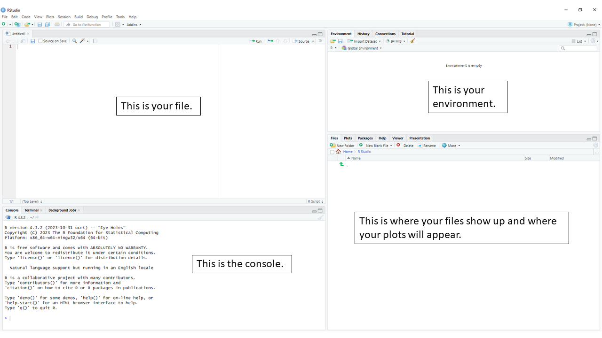
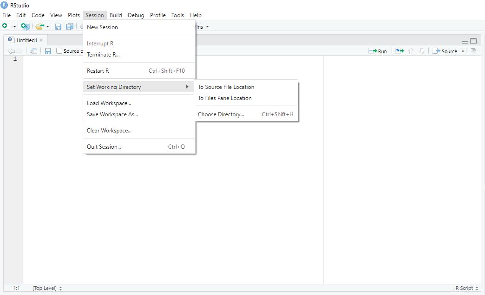
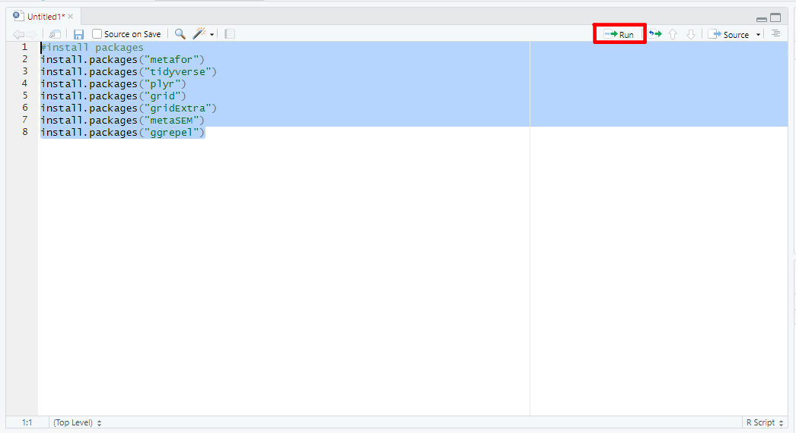

# (PART) Meta-Analysis in R {.unnumbered}

# R Basics {#rbasics}

Alright, we're getting to the good stuff here, how to use R. You might be a bit anxious because R requires coding, but don't worry, we'll walk through everything step by step.

## Why use R when a GUI-based Platform is Easier?

At the time of writing, GUI-based platforms such as [Comprehensive Meta-Analysis](https://meta-analysis.com/) (paid software at the time of writing), [JASP](https://jasp-stats.org/) (free software at the time of writing), and [Jamovi](https://www.jamovi.org/) (free software at the time of writing) are excellent for conducting conventional meta-analyses. They can help you analyze the data quickly, without having to know how to do any coding in R. However, some of these options are limited in terms of reproducibility, meaning someone would need the same program to confirm your analysis. While this may seem like a minor limitation to some, it is actually quite important.

Another limitation of many GUI-based platform is that (at the time of writing) they do not allow one to conduct multivariate or three-level meta-analyses, among other limitations. In the educational sciences, three-level meta-analysis seems to offer advantages because you can account for, for example, all of the learning outcome tests in a study rather than only one learning outcome test per study. In other words, the three-level meta-analysis can account for the dependence between effect sizes, whereas a conventional (two-level) meta-analysis cannot. This factor alone is what convinced me that I needed to learn R!

One final thing I found I enjoyed about learning R and metafor[@viechtbauer2010] was that it taught me just how much you may not realize might be happening behind the scenes in GUI-based software. For example, do you know what estimator you're using in the GUI-based software? Are you using a Knapp-Hartung adjustment? These kinds of questions are important, yet you may not think about them if you just copy-pasted your data and asked the software to run the analysis.

Let's get started using R.

## Install R and R Studio

You can [download and install R here](https://www.r-project.org/) and I recommend [downloading and installing R Studio](https://posit.co/download/rstudio-desktop/) (there is a free version) as well.

Once you have R and R Studio installed, you'll want to open R Studio.

## What You Need to Know

What do I think you *need* to know about R and R Studio before continuing in this book? Well, honestly not a lot. I've tried to break it down into very simple terms. I would install R and R Studio, then continue with the book as long as you know where to enter code into the file you're working on (top left of R Studio for me), where the console is (bottom left of R Studio for me), where the environment is (top right of R Studio for me), and where the files and plots appear (bottom right of R Studio for me). If you understand those big ideas, I think you'll likely be OK to move forward. Here's a screenshot of R Studio so you can see where everything is on my set up (which I believe is the default).

{width="100%"}

### Set Your Working Directory

You'll need to tell R where to save your files and where to retrieve files from, which is known as your working directory. For simplicity, I set up a new project folder on my desktop, and I save my data file there. Then I set that folder as my working directory. To set your working directory, you click on session, then set working directory, as seen in the screenshot below. I would choose the "choose directory" option, then choose my desktop folder that is my project folder.

{width="100%"}

### Install R Packages We'll Need for Meta-Analysis

We'll need to install a few R packages before continuing into this book. Fortunately, this is super easy! Let's see how to do this.

In your file (see screenshot above) you want to enter the following code:

::: rmdnote
``` r
#install packages
install.packages("metafor")
install.packages("tidyverse")
install.packages("plyr")
install.packages("grid")
install.packages("gridExtra")
install.packages("metaSEM")
install.packages("ggrepel")
```

*What will this code do?*

This code will install the named packages into your computer so that R understands the functions built into each one.

*How do I get it to actually install or run code?*

Now that you've copy-pasted the code into your file, you want to highlight the code, then click 'run' in the top right of the file area. See the screenshot below, where run is highlighted in red.

{width="100%"}

After you click run, you'll see things appear in the console. That's normal. It will take a few minutes for the packages to install, but once they're done, you're ready to move forward. Once a package is installed, you don't need to install it every time you run an analysis. We will just open them. If you don't know how to do that, don't worry, I'll walk you through this as we go through each chapter.
:::

#### Was that easy?

If this first step was easy or you figured it out without too much trouble, I think you're ready to move forward in the book. The meta-analysis codes sections of the book rely on you copy-pasting sections of code from the book into your R Studio interface, then highlighting the relevant section of code you just copy-pasted into R Studio, and then clicking 'run'.

#### Was this too difficult?

If you struggled to keep up so far, then I would suggest you start at the very basics. There are so many resources online, I don't see a reason to rewrite what others have written about extensively. I know getting started with R Studio can be intimidating. It seems scary and complicated. After you get started and start writing your own code, it won't seem so scary. Here is a starting point: <https://education.rstudio.com/learn/beginner/>

How not scary does R become? Well, you may be surprised to hear that I wrote this entire book in R Studio using the bookdown package. R is very versatile!
