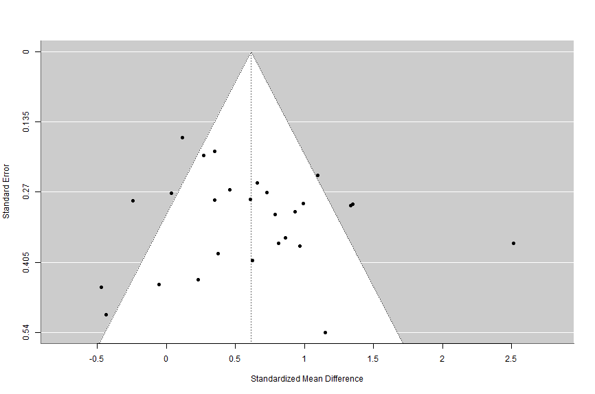

# Conventional Meta-Analysis {#meta}

This chapter will cover the basics of conventional (two-level) meta-analysis in R using metafor [@viechtbauer2010]. In conventional meta-analysis, a very important limitation is known as the **principle of statistical independence**, meaning that each participant can only be counted once. What does this mean for you as a researcher?

Let's look at an example: Say you are comparing the impact of a computer on learners' reading proficiency compared to other media. You found a study that meets your inclusion criteria but it has three groups: a computer group, a tablet group, and a paper book group. You can see you have two possible comparisons here: computer vs tablet, and computer vs paper book. You may think that you can include both of these comparisons in your conventional meta-analysis. **However, this is incorrect.** Doing this would count the computer group twice, therefore violating the principle of statistical independence. As such, [you must make a decision]{.underline}: which comparison do you want to include? Alternatively, you could (but I wouldn't) take the weighted mean and pooled standard deviation of the two non-computer groups to create a comparison that does not duplicate the computer group's scores. I say I would not do this latter approach because it will add conflating factors into your analysis. Remember - a meta-analysis is only as useful as the types of data that went into it!

Another popular issue is the question of fixed effects and random effects models. Simply stated, we almost always use random effects models in education, so all examples in this book will use random effects. If you don't know the differences between fixed and random effects meta-analysis models, please see [@borenstein2010].

If you aren't familiar with conventional meta-analysis, please read about it before conducting one. There are plenty of free resources available. I would recommend starting with the great, free book, [Doing Meta-Analysis in R](https://bookdown.org/MathiasHarrer/Doing_Meta_Analysis_in_R/)[@harrer2021].

Let's say you understand the differences between conventional and three-level meta-analytic models, you understand what meta-analysis is used for, and you've decided you're moving ahead with the conventional model. Let's explore how to do this in R with metafor[@viechtbauer2010] using standardized mean differences as the effect size.

## Preparing your data

Hopefully you have already run your [literature search](#literaturesearch), [screened your studies](#screening), and [extracted your data](#data). This point forward assumes you have already completed these steps.

### Your Data File

Personally I prefer to use .csv files as my data file that I import into R. Why? Because that’s what was always used in the examples I found online when I was learning R, and I’ve used it ever since. Why change something that works? Plus, .csv works with many different software programs and across various operating systems.  

As noted in the [data extraction and coding chapter](#data), metafor uses two pieces of information for conducting the meta-analysis that you need to consider before importing data in R: the effect size (***yi***) and the variance (***vi***). If you read the previous chapters, you know you have choices when coding: you can code the mean, standard deviation, and sample size for the experimental and control groups and then use R and metafor to calculate the effect size and variance for each comparison (my recommended method), or you can calculate the effect size and variance for each effect size yourself. I prefer the former approach because I find it helpful to have all of this data to not only check for errors in coding (such as a misplaced decimal point – these things happen!) and also for calculating sample sizes for tables.

If you choose to use R and metafor to calculate the effect sizes and variance, it will be important to have each mean, standard deviation, and sample size for the experimental group and the control group in their own columns. I recommend having simple column titles that are descriptive and easy to remember, because you will have to type them into R. **See a sample coding form below, which we will use for our conventional meta-analysis**. Note that you can have as many moderator variables as you wish, and they can be continuous or categorical.

So, assuming you have all of that done, let's get onto the fun stuff, running a conventional meta-analysis!

## Running a Conventional Meta-Analysis with Metafor

### Example Data for This Analysis

If you want to follow along with this specific example, you'll want to use the subset of data from Schroeder and Cenkci's (2018)[@schroeder2018] meta-analysis on the spatial split-attention effect. The data can be [downloaded here](https://github.com/noah-schroeder/reviewbook/blob/abfdb439ef81267b388ef75067a03262e1e59020/SC%20sample%20data.csv).

### Load R Packages

First we need to load our R packages. Hopefully you installed these already, if not it won't take long, just see the [R Basics chapter](#rbasics). Assuming you have already installed the R packages, let's load them up so we can do some meta-analysis!

::: rmdnote
``` r
#load metafor
library(metafor)
library(tidyverse)
```

*What's this code doing?*

This code is simply loading the metafor package in the R environment so we can do our analysis. It's also loading tidyverse, which we'll use to help us calculate participant numbers and create tables.
:::

### Import Your Data Into R Studio

The first step to conducting your meta-analysis is to read in the data. To do that, we first want to set our working directory (more about that in the [R Basics chapter](#rbasics)). Once you've set your working directory and saved the SC sample data file there, you can use this piece of code.

::: rmdnote
``` r
#name data file and read in .csv. 
dat <- read.csv("SC sample data.csv")
```

*What's this code doing?\
*You see the first piece of code is '**dat**', which is what we are going to name our data file. The **\<-** indicates that you are going to name something. The next piece is telling R to read in a .csv file from the working directory, and then you can see the file name I used. So basically, we're saying *import this data from a .csv file and call it dat.*

After you run this, you'll see an item called 'dat' appear in your environment, which contains your data!
:::

### Calculating Effect Sizes

Next, you will want to calculate the effect sizes and variance for each comparison if you have not done so already. You can do that using this code:

::: rmdnote
``` r
#calculate overall ES, in this case standardized mean difference (Hedges g), and variance.

dat1 <- escalc(measure="SMD", m1i=Exp_mean, sd1i=Exp_sd, n1i=Exp_n, m2i=Ctrl_mean, sd2i=Ctrl_sd, n2i=Ctrl_n, data=dat)
```

*What's this code doing?*

**dat1 \<-** indicates naming a new datafile.

In this case you’re doing a calculation, **Escalc** is telling it calculate an effect size. Within that function, **measure="SMD"** is saying we want to use the standardized mean difference.

The next set of variables (**m1i, sd1i, n1i, m2i, sd2i,** and **n2i**) are specific pieces of information that metafor needs to calculate the effect size. **m1i** is the mean of the intervention group. **sd1i** is the standard deviation of the intervention group. **n1i** is the sample size of the intervention group. **m2i** is the mean of the control group. **sd2i** is the standard deviation of the control group. **n2i** is the sample size of the control group. I have always found those codes hard to remember, so on my coding form/data file I use different column headings. You can see I tell metafor where to find each variable by using the **=** sign. For example, the mean of the intervention group (**m1i**) is called **Exp_mean** in my data file.

Finally, we need to tell metafor where to find the data, and we have to refer to data already in R. We use our datafile '**dat**'.
:::

Now if you want to, you can make sure the effect size and variance for each effect size were calculated:

::: rmdnote
``` r
#display data
dat1
```

*What's this code doing?*

This will display your full data set saved as '**dat1**' in the console.
:::

However, I find this kind of hard to read if I have a lot of data. So, I prefer to write it all to a .csv file instead because I find it easier to read. This code can do that:

::: rmdnote
``` r
#save .csv file with ES data. This goes into working directory
write.csv(dat1, file = "ESdata.csv")
```

*What's this code doing?*

The **write.csv** tells R you want to create a .csv file. This will be saved in your working directory.

The **dat1** is telling R which data you want to write into the .csv file.

**file = "ESdata.csv"** is simply naming the datafile whatever you have between the " ". You can name it whatever you want, but my example will use ESdata as the file name, and I'll assume this is the case through the rest of the analysis.
:::

You're probably wondering, *Why write a .csv file with the effect size and variance data when it is saved in R?*

Well, I like to look at the .csv file and make sure I don't see any effect sizes that seem very wrong. If I find any then it is easy for me to track back to which study it came from and I can see if I made a mistake during coding. A misplaced decimal point can have huge implications for your analysis - this is a step that helps you catch those human errors.

## Running The Meta-Analysis Model

Now the part we've all been waiting for, let's run a meta-analysis model! We can use this code:

::: rmdnote
``` r
#run overall random effects meta-analysis
overallresult <- rma(yi, vi, data=dat1)
```

*What's this code doing?*

First, we're naming our meta-analysis result as a new piece of data in R, and we're naming it '**overallresult**'

**rma** is telling metafor that we want to run a random-effects, conventional meta-analysis model. Within that, we're using **yi** to reference effect size data within our data set (this is a column heading), **vi** to reference effect size variance within our data set (this is a column heading), and **data = dat1** is simply telling metafor which data set within R to reference when running the analysis. Note that we're using dat1, rather than dat, because dat1 contains the effect sizes and variances we calculated, whereas dat does not.
:::

So we ran this code and.... seemingly nothing happened? Well, if you look at your environment, you'll see the new item called overall result. Let's view that in our console now so we can see the overall result of our meta-analysis:

::: rmdnote
``` r
#display meta-analysis result
overallresult
```

*What's this code doing?*

This code simply displays the result in the console so you can see the meta-analysis result.
:::

### Interpreting the Results

When we run that code, we now see the following:

::: rmdnote
```         
Random-Effects Model (k = 27; tau^2 estimator: REML)

tau^2 (estimated amount of total heterogeneity): 0.2372 (SE = 0.0940)
tau (square root of estimated tau^2 value):      0.4870
I^2 (total heterogeneity / total variability):   73.51%
H^2 (total variability / sampling variability):  3.77

Test for Heterogeneity:
Q(df = 26) = 90.0975, p-val < .0001

Model Results:

estimate      se    zval    pval   ci.lb   ci.ub      
  0.6142  0.1127  5.4512  <.0001  0.3934  0.8351  *** 

---
Signif. codes:  0 ‘***’ 0.001 ‘**’ 0.01 ‘*’ .05 ‘.’ 0.1 ‘ ’ 1
```

*What's this mean?*

Recall this is a subset of data from Schroeder and Cenkci (2018)[@schroeder2018], so the numbers will not align with what is in the published version.

The first line tells us this is a random-effects model including 27 comparisons, and tau^2^ was estimated using restricted maximum likelihood estimation (REML).

Typically, the important pieces here that we are interested in reporting in our manuscript are the overall effect size, the *Q*-test, and the *I*^2^.

The effect size (the estimate under the model results) is interpreted as the standardized mean difference effect size, if there is a significant *Q* test it indicates there is significant heterogeneity in our sample, and the *I*^2^ statistic gives us a percentage that is commonly used to report between-study heterogeneity.
:::

### Checking for Outliers and Influence

At this point we've ran our random-effects meta-analysis model. However, we have not checked for outliers or studies with significant influence on the results. This is actually a complex topic, as not many meta-analyses (as of January, 2024) in education actually address a) if they searched for outliers or influence, b) what metric they used to check for outliers and why, and c) what they did about the outliers and why. Kinda of interesting right?

So here's what we can do to check for outliers and influence. We'll follow Viechtbauer and Cheung's (2010) [@viechtbauer2010a] process, which fortunately is built right into metafor. Similarly, you should also know about [this website](https://wviechtb.github.io/metafor/reference/influence.rma.uni.html) which describes the function we'll use.

::: rmdnote
``` r
#check for outliers
influence(overallresult)
```

*What's this code doing?*

This tells metafor to produce influence diagnostics for the meta-analysis model (which we called '**overallresult**' in an earlier step).
:::

Once we run that, we'll see a bunch of data in the console. It'll look like this:

::: rmdnote
``` r
  rstudent  dffits cook.d  cov.r tau2.del  QE.del    hat weight    dfbs inf 
1    0.6685  0.1352 0.0188 1.0679   0.2458 87.9029 0.0394 3.9410  0.1353     
2    0.9087  0.1928 0.0375 1.0537   0.2399 84.8441 0.0432 4.3182  0.1929     
3    0.5790  0.1083 0.0120 1.0629   0.2462 88.9252 0.0336 3.3650  0.1081     
4   -1.5995 -0.3258 0.0986 0.9709   0.2146 81.8692 0.0397 3.9747 -0.3253     
5   -0.5008 -0.1096 0.0126 1.0913   0.2509 88.7138 0.0464 4.6375 -0.1100     
6   -0.5864 -0.1030 0.0108 1.0550   0.2451 89.5042 0.0296 2.9570 -0.1027     
7   -0.9935 -0.2231 0.0498 1.0501   0.2371 81.6753 0.0480 4.8003 -0.2231     
8    1.3164  0.2661 0.0684 1.0066   0.2262 83.0741 0.0391 3.9107  0.2659     
9    3.7924  0.6914 0.3325 0.6777   0.1237 61.5550 0.0340 3.4049  0.7120   * 
10  -0.2785 -0.0576 0.0035 1.0906   0.2525 89.9252 0.0412 4.1216 -0.0577     
11   0.3018  0.0598 0.0037 1.0827   0.2511 89.5783 0.0379 3.7881  0.0598     
12   0.2050  0.0421 0.0019 1.0918   0.2530 89.7261 0.0409 4.0860  0.0421     
13  -0.4720 -0.0961 0.0096 1.0802   0.2496 89.4834 0.0399 3.9877 -0.0962     
14  -1.0632 -0.2193 0.0478 1.0359   0.2351 86.1101 0.0408 4.0790 -0.2193     
15   0.0796  0.0165 0.0003 1.0966   0.2541 89.9615 0.0422 4.2171  0.0165     
16   0.0159  0.0028 0.0000 1.0733   0.2502 90.0770 0.0319 3.1859  0.0028     
17   1.3506  0.2737 0.0721 1.0025   0.2249 82.6657 0.0393 3.9277  0.2735     
18   0.5500  0.1096 0.0124 1.0730   0.2479 88.6613 0.0383 3.8253  0.1096     
19   0.3245  0.0610 0.0039 1.0737   0.2496 89.6452 0.0340 3.4041  0.0609     
20   0.4078  0.0775 0.0062 1.0724   0.2489 89.4124 0.0347 3.4717  0.0773     
21  -0.3888 -0.0719 0.0053 1.0689   0.2485 89.8413 0.0327 3.2714 -0.0718     
22  -0.6555 -0.1428 0.0211 1.0797   0.2474 87.7178 0.0458 4.5805 -0.1433     
23  -0.0092 -0.0020 0.0000 1.0920   0.2534 90.0749 0.0400 3.9967 -0.0020     
24  -1.5371 -0.2464 0.0592 0.9875   0.2247 86.1028 0.0257 2.5745 -0.2480     
25   0.7452  0.1174 0.0139 1.0383   0.2416 88.9126 0.0240 2.4018  0.1171     
26  -1.6889 -0.2854 0.0780 0.9711   0.2184 84.7843 0.0287 2.8680 -0.2875     
27  -1.0243 -0.1771 0.0313 1.0289   0.2369 88.1449 0.0290 2.9037 -0.1771
```

*What's this result mean?*

While this data looks scary at first, it's actually really easy to interpret. Why? Well, check that last column labeled 'inf'. This tells us if any studies were outliers or significantly influenced our results. From here we can see that study 9 was potentially an outlier or had a significant influence on the result. You can read about influence diagnostics and the metrics used [here](https://wviechtb.github.io/metafor/reference/influence.rma.uni.html) and in Viechtbauer and Cheung (2010)[@viechtbauer2010b].
:::

We know from this data that study 9 in our dataset is a potential outlier or has significant influence on our result. What do we do from here? Well, there's a lot of options, but here are my recommended steps:

-   Go back to your data and check the effect size. Is it oddly large or small? If so, check and see if you have a typo in the data.

-   Let's say the data has no errors. Next we'll look at the study itself. Is there something substantially methodologically 'wrong' or is it significantly different than the other studies in your sample? If so, you may be able to rationalize removing the study from your data set. If you do remove it, be sure to report that you did, and why, in your manuscript.

-   Ok so now things get real: Let's say your data is good, and the study itself was pretty well-done and not notably different than your other studies in the sample. What do you do? Well, that's a matter of opinion.

    -   My current personal opinion is generally to retain the study as is - because it is valid data.

    -   Another option is to "downsize" the effect size to slightly larger (or smaller) than the next largest (or smallest) effect size.

        -   I don't prefer this approach because I think valid data should be examined as valid data, but this is a reasonable option. The problem I have with this approach is that I have never seen a metric for how much "larger" or "smaller" you should change the effect size to. So I guess you just... guess? That seems imprecise to me and since it can/will influence your whole analysis, I don't like that.

    -   A final option is to remove the outlier from the dataset.

        -   I generally don't like this option because I cannot rationalize it if the study was consistent with the rest in the analysis.

For the purposes of this example, we'll assume that the data are good, and there was nothing particularly notable about the study itself. Therefore we will retain the effect size in the data.

### Writing up the Results

So if we were going to write this up, we may report something like this:

> We conducted a random-effects meta-analysis of 27 independent comparisons. Our results indicated that the intervention was significantly better than the control condition (*g* = .61, *p* \< .001). Moreover, the model indicates that there is significantly heterogeneity within the sample (*Q*(26) = 90.10, *p* \< .001), and 73.51% of the variance within the sample is due to between-study heterogeneity. We detected one study as a potential outlier or as having significant influence on the overall effect size, however examination of the study did not indicate any notable deviations from other studies in our sample. As such, the study was retained in the data analysis.

### Forest Plots

We should always include a forest plot with our results. We can create one with this code:

::: rmdnote
``` r
#forest plot run this entire code section together. 
forestplotdetails<-forest.rma(overallresult, slab=paste(dat1$studyauthor), main = "Forest Plot of Observed Effects", header="Author(s) and Year")
#this sets the text labels. first text position is X axis, second is y. 
op <- par(cex=.75, font=2)
text(-7.75, 60, "Authors and Year", pos=4)
text(10, 60, "Effect Size (g) [95% CI]", pos=2)
par(op)
forestplotdetails ##this will print details for forest plot size which helps with text location
```

*What's this code doing?*

This code is more complex, but we can look at some bigger pieces of it. The first line is setting '**forestplotdetails**' as a named data in your R environment. Then you're referencing a function in metafor (**forest.rma**) and telling it to use the data from '**overallresult**', our meta-analysis result in the R environment. Next we see '**slab=paste....**' and this is telling metafor which dataset to use (**dat1**). The **\$studyauthor** tells metafor where to get the data to fill in the Author and Year column in our dataset. The '**main**' and '**header**' are for the headings on the forest plot.

The rest of the code is more complex and has to do with the specifics of setting the specific titles. I copy-pasted it from example code I found online and it has worked for me. You may find you need to move the text positions, which is why the **forestplotdetails** data might be helpful.

If this code works correctly for you, the forest plot should appear in the plots section of R studio. You can save it by clicking on export (in the toolbar above the plot), and following the options to save the file.
:::

### Moderator Analysis

We've ran our overall random-effects meta-analysis model. Some people think this is the important finding, but in education, I think this result is generally only *kind of* interesting. The *really* good stuff, in my opinion, is examining all the potential moderator variables. Essentially, we're going to check and see what variables may influence the overall effect size.

What might be a moderator variable? Well, it depends on your field and the intervention you're investigating. In educational technologies, we typically examine participant characteristics, study characteristics, and intervention characteristics as potential moderators.

So, let's get right to it! We're going to focus on categorical moderators because there are a plethora of resources online about how to run continuous moderators.

::: rmdimportant
**WARNING**: To run a categorical moderator analysis in metafor is actually two steps and they look similar. Let's take a look at the different steps.
:::

#### Calculate Q~between~

First we need to calculate Q~between~. This is an omnibus test that will tell us if there are significant differences [between levels of the moderator]{.underline}. We're going to use grade range as our example:

::: rmdnote
``` r
#moderator test to calculate qbetween value. 
mod.gradeq <- rma(yi, vi, mods = ~ factor(graderange), data=dat1)
#Display moderator Qbetween result
mod.gradeq
```

*What's this code doing?*

The first line is first creating a piece of data in R, which we're naming **mod.gradeq** (which to me, stands for moderator, grade, qbetween, but you can name it whatever you want). Next you'll see the familiar **rma** code, but the new piece is the '**mods = \~ factor(graderange)**' piece. This is saying we want to run a moderator analysis with **graderange** (that's the column name in our data set) as the moderator.

The second line simply displays the data on the screen.
:::

When we run that code, we're presented with the following:

::: rmdnote
``` r
Mixed-Effects Model (k = 27; tau^2 estimator: REML)

tau^2 (estimated amount of residual heterogeneity):     0.2302 (SE = 0.1006)
tau (square root of estimated tau^2 value):             0.4798
I^2 (residual heterogeneity / unaccounted variability): 72.28%
H^2 (unaccounted variability / sampling variability):   3.61
R^2 (amount of heterogeneity accounted for):            2.96%

Test for Residual Heterogeneity:
QE(df = 22) = 75.7955, p-val < .0001

Test of Moderators (coefficients 2:5):
QM(df = 4) = 4.2829, p-val = 0.3691

Model Results:

                                                                     estimate      se     zval    pval    ci.lb   ci.ub 
intrcpt                                                                0.6096  0.3216   1.8956  0.0580  -0.0207  1.2400 
factor(graderange)Grades K-5                                          -0.4136  0.4911  -0.8423  0.3996  -1.3761  0.5489 
factor(graderange)Not Stated                                          -0.5549  0.5093  -1.0895  0.2759  -1.5531  0.4433 
factor(graderange)Other (combined grades)                              0.3815  0.6470   0.5896  0.5555  -0.8866  1.6495 
factor(graderange)Post-Secondary (Undergraduate/Graduate/Technical)    0.1060  0.3492   0.3036  0.7614  -0.5785  0.7905 
                                                                       
intrcpt                                                              . 
factor(graderange)Grades K-5                                           
factor(graderange)Not Stated                                           
factor(graderange)Other (combined grades)                              
factor(graderange)Post-Secondary (Undergraduate/Graduate/Technical)    

---
Signif. codes:  0 ‘***’ 0.001 ‘**’ 0.01 ‘*’ 0.05 ‘.’ 0.1 ‘ ’ 1
```

*What's this result mean?*

There's a lot of information here but we only want one thing: **The test of moderators.** In this case, that's Test of Moderators (coefficients 2:5): QM(df = 4) = 4.2829, p-val = 0.3691

[What we're doing here is checking the p value.]{.underline} We can see this test is not significant, which means that this is not a statistically significant moderator. In other words, for this example, the effect of the intervention was not significantly different for participants in K-5 than participants in Post-Secondary Education.
:::

With our Q~between~ value in hand, we now need to create the actual table we'll report in the manuscript. You'll note that when we calculated Q~between~, one of the levels of the moderator was missing, and replaced by the term intercept. Well, it's time to fix that and get the tables we would use for reporting in our manuscript.

We'll use a very similar code:

::: rmdnote
``` r
#moderator test to get mean effect size for each group.
mod.grade <- rma(yi, vi, mods = ~ factor(graderange)-1, data=dat1)
#Display moderator result
mod.grade
```

*What's this code doing?*

The first line is first creating a piece of data in R, which we're naming **mod.grade** (which to me, stands for moderator, grade, but you can name it whatever you want). Next you'll see the familiar **rma** code, with the '**mods = \~ factor(graderange)**' piece. This is saying we want to run a moderator analysis with **graderange** (that's the column name in our data set) as the moderator. What's new here is the **-1**, which [removes the intercept and runs an ANOVA type model]{.underline} that we're used to seeing for categorical variables in educational meta-analyses.

The second line simply displays the data on the screen.
:::

When we run that code, we'll get our results, which look like this:

::: rmdnote
``` r
Mixed-Effects Model (k = 27; tau^2 estimator: REML)

tau^2 (estimated amount of residual heterogeneity):     0.2302 (SE = 0.1006)
tau (square root of estimated tau^2 value):             0.4798
I^2 (residual heterogeneity / unaccounted variability): 72.28%
H^2 (unaccounted variability / sampling variability):   3.61

Test for Residual Heterogeneity:
QE(df = 22) = 75.7955, p-val < .0001

Test of Moderators (coefficients 1:5):
QM(df = 5) = 34.6351, p-val < .0001

Model Results:

                                                                     estimate      se    zval    pval    ci.lb   ci.ub 
factor(graderange)Grades 6-8                                           0.6096  0.3216  1.8956  0.0580  -0.0207  1.2400 
factor(graderange)Grades K-5                                           0.1960  0.3711  0.5282  0.5974  -0.5313  0.9234 
factor(graderange)Not Stated                                           0.0548  0.3949  0.1386  0.8897  -0.7193  0.8288 
factor(graderange)Other (combined grades)                              0.9911  0.5614  1.7654  0.0775  -0.1092  2.0914 
factor(graderange)Post-Secondary (Undergraduate/Graduate/Technical)    0.7157  0.1362  5.2561  <.0001   0.4488  0.9825 
                                                                         
factor(graderange)Grades 6-8                                           . 
factor(graderange)Grades K-5                                             
factor(graderange)Not Stated                                             
factor(graderange)Other (combined grades)                              . 
factor(graderange)Post-Secondary (Undergraduate/Graduate/Technical)  *** 

---
Signif. codes:  0 ‘***’ 0.001 ‘**’ 0.01 ‘*’ 0.05 ‘.’ 0.1 ‘ ’ 1
```

*What's this result mean?*

This looks almost identical to the previous result when we calculated Q~between~. However, you'll note that the intercept is now gone and instead all of our levels of the moderator are listed (in this case, the different grade ranges). **These are the means, standard errors, p values, etc. that you will want to report in your manuscript.**

Note that the test of moderators is different than before. Confusing right? [Well, that's because the two tests, while named the same thing, are testing different things.]{.underline} When we calculated Q~between,~ the test of moderators was testing if there were significant differences between levels of the moderator. However, in this test of moderators it is testing if the moderators are significantly different than zero. These are totally different tests - **do not use this test of moderator as your Q~between~ value because it most certainly is not!**
:::

What if you have more categorical moderator variables to test? Well, you simply replace the '**graderange**' variable with whatever each categorical moderator variable column in your data is labeled as, and don't forget to rename the data items as well (**mod.gradeq** and **mod.grade**). Then you can re-run the same two code sets to calculate Q~between~ and the effect sizes.

#### Easily Create Tables

Have you tried to copy-paste the results of the moderator analysis from the console into a word processing software yet? Go ahead and try, the book will be here while you test it out.

So you tried it, and that looks terrible right? And the tables are missing data reviewers want to see, like the number of participants per level of moderator. What if I told you that Chris Palaguachi and I have already spent time creating the code to create these tables? Let's take a look at the code that will save you hours and hours of calculations and table manipulations.

##### Create the Summary Table

First we'll create the summary table. This is way easier than it sounds.

::: rmdnote
``` r
#Only save table results 
mod.grade_table <-coef(summary(mod.grade))
```

*What's this code doing?*

First, we're creating a new data item, called **mod.grade_table**. The **coef(summary(mod.grade))** is simply telling metafor we want the coefficient summary for the **mod.grade** data - which is what we called our moderator analysis of the grade levels.

Overall, this basically saves most of the data we want as a separate table.
:::

So now we have a beautiful summary table. We could write this to a spreadsheet now... but what about the number of participants in each condition for each level of the moderator? And what about the number of comparisons for each moderator? We could hand calculate those... but that sounds boring and takes a long time. We could program in the analyses individually... but that is also boring (I've done that more than I want to admit). Or, we can use this code Chris and I created to do that automatically:

##### Calculating Participant and Comparison Numbers, and Saving the Table

First, we'll compute the number of participants from the experimental and control conditions for each level of the moderator. We'll also calculate the number of comparisons for each level of the moderator. Finally, we'll bind these to the pre-existing table, and write all of this information as a table in a .csv file.

::: rmdnote
``` r
#calculate participants in each group and add it to the table, then save the table.
gradeSumParticipants <- dat1 %>%
  group_by(graderange) %>%
  summarise(nexp = sum(intn, na.rm = TRUE),
            nctrl = sum(cn, na.rm = TRUE))
gradeNumComp <- dat1 %>%
  count(graderange)
gradeNumComp <- rename(gradeNumComp, kcomparisons = n)
grade_type_table.final<- cbind(gradeSumParticipants,gradeNumComp[c(2)], mod.grade_table) 
write.csv(grade_type_table.final, "Mod.gradeResult.csv")
```

*What's this code doing?*

There's a lot more going on in this code, so we'll look at major pieces.

First, we create a new data item called **gradeSumParticipants**. This data is counting the number of participants in the experimental and control conditions, and naming them **nexp** and **nctrl**, respectively.

Next, we have a new item called **gradeNumComp**. This is counting the number of comparisons in each item. We then create a new data item (**gradeNumComp**) and rename it **kcomparisons**.

Finally, we create a new table, bind all the data together, and write it as a csv file.
:::

How great is that? We now have almost all the data we need from the moderator analysis. The only piece of information missing is the *Q~between~* value. Guess what, we have a script to record that too. First, a warning:

::: rmdimportant
**IMPORTANT NOTE**: This code will print the *Q~between~* data twice. The first will be presented as: *Q~between~* (df) = #, *p* = #. The second will be presented with NA instead of the actual degrees of freedom. You want the result with the degrees of freedom, and you can ignore the result with NA printed.

Example: Our .txt file will contain this: Qb( 4 ) = 4.28 , p = 0.369 Qb( NA ) = 4.28 , p = 0.369 The first section, Qb( 4 ) = 4.28 , p = 0.369, is the proper information for reporting the result of the analysis.
:::

The warning heeded, let's take a look at the code:

::: rmdnote
``` r
# Save QM Test and write it into a text file
Qgrade_collapsed_string <- paste(mod.gradeq[["QMdf"]])
Qgrade_type1 <- data.frame(CollapsedQMdf = Qgrade_collapsed_string)
Qgrade_type2 <- round(mod.gradeq$QM,2)
Qgrade_type3 <- round(mod.gradeq$QMp,3)

QgradeQ <- paste(
  "Qb(",Qgrade_collapsed_string,") =", 
  Qgrade_type2,
  ", p =", 
  Qgrade_type3,
  collapse = " "
)

cat(QgradeQ, "\n")
gradeQtest <- data.frame(Text = QgradeQ)
write.table(gradeQtest, file = "QgradeQ.txt", row.names = FALSE, col.names = FALSE, quote = FALSE)
```

*What's this code doing?*

This is another complex code. First, we are extracting some data from the moderator analysis (The relevant *Q* statistics) and naming them something else.

Then we are writing them into the format we want.

Then we write them into a .txt file in the format we should be used to seeing for *Q~between.~*
:::

Ok, so now we've gotten our moderator analyses run, and all of our information extracted. We can simply replicate this code, changing our categorical moderator names and variable names where required. You should also change the name of the file being written. I like to make it the same as the moderator name to minimize confusion later. I recommend having a copy of the code for each variable, and using find and replace to replace the moderator names. It's quite efficient!

### Publication Bias

Oh we're not done yet, we haven't even talked about publication bias yet! Don't worry, this is pretty easy because metafor, again, has some great built-in functions.

#### Funnel Plot

First we'll create a funnel plot and check it for asymmetry.

::: rmdnote
``` r
#standard funnel plot
funnel(overallresult)
```

*What's this code doing?*

This code simply tells metafor to create a funnel plot of the overall meta-analysis result data.
:::

When we run that code we'll see the following:

{width="100%"}

#### Trim and Fill Analysis

Next we'll check out a trim and fill analysis to see what it finds.

::: rmdnote
``` r
# carry out trim-and-fill analysis
trimandfill <- trimfill(overallresult)
trimandfill
```

*What's this code doing?*

First we are creating a new item, which we call '**trimandfill**'. Then we use the **trimfill** function with the data from the overall meta-analysis result.

The second line of code simply displays the results.
:::

Running that code gives us the following results in our console:

::: rmdnote
``` r
Estimated number of missing studies on the right side: 2 (SE = 3.3967)

Random-Effects Model (k = 29; tau^2 estimator: REML)

tau^2 (estimated amount of total heterogeneity): 0.2780 (SE = 0.1034)
tau (square root of estimated tau^2 value):      0.5273
I^2 (total heterogeneity / total variability):   75.67%
H^2 (total variability / sampling variability):  4.11

Test for Heterogeneity:
Q(df = 28) = 103.1403, p-val < .0001

Model Results:

estimate      se    zval    pval   ci.lb   ci.ub      
  0.6774  0.1161  5.8323  <.0001  0.4497  0.9050  *** 

---
Signif. codes:  0 ‘***’ 0.001 ‘**’ 0.01 ‘*’ 0.05 ‘.’ 0.1 ‘ ’ 1
```

*What's this result mean?*

The first line tells us that the analysis indicates that 2 studies may be missing from the right side of the funnel. The model results are the overall meta-analytic effect (and accompanying other data) if these two studies were imputed.
:::

Let's also check out what the funnel plot would look like if we add the missing studies indicated by the trim and fill analysis.

::: rmdnote
``` r
# draw funnel plot with missing studies filled in
funnel(trimandfill)
```

*What's this code doing?*

We're telling metafor to use its **funnel** function on the **trimandfill** data to create a funnel plot with the missing studies included.
:::

When we run that code, we see the following chart in our plots:

{width="100%"}

So from the trim and fill analysis, we know that there are two studies potentially missing on the right side of the funnel. We also know that if they were included the overall meta-analytic effect size would be *g* = .68. Recall that the overall meta-analytic model indicated our effect size was *g* = .61. In this case, these studies absence would not notably change our overall effect size, so it is not too much of an issue. In addition, if these missing studies were included, our effect size would actually be stronger than the one we computed.

#### Egger's Regression

Another test we can use is Egger's regression which checks for funnel plot asymmetry. It's simple to calculate, just use the code below:

::: rmdnote
``` r
#Egger's regression
regtest(overallresult)
```

What's this code doing?

This runs Egger's regression test using the data from the overall meta-analysis result.
:::

Running that code gives us this result:

::: rmdnote
``` r
Regression Test for Funnel Plot Asymmetry

Model:     mixed-effects meta-regression model
Predictor: standard error

Test for Funnel Plot Asymmetry: z = -0.0380, p = 0.9696
Limit Estimate (as sei -> 0):   b =  0.6299 (CI: -0.2071, 1.4669)
```

*What's this result mean?*

Here we want to look at the p value. If it's less than .05, we know that there may be significant funnel plot asymmetry.
:::

#### Fail Safe N

Some reviewers will want to see Fail Safe N tests. There are a few variants, but we'll focus on Rosenthal's Fail Safe N. This is the most common fail safe n test I see reported in the literature. We can use this code to calculate it.

::: rmdnote
``` r
#Rosenthal fail safe n
fsn(yi, vi, data=dat1)
```

*What's this code doing?*

This code is telling metafor to use the fail safe n function (**fsn**), referencing the effect size (***yi***) and variance (***vi***) from the **dat1** dataset (recall this was used to calculate our overall meta-analytic model).
:::

When we run that code, we get the following result:

::: rmdnote
``` r
Fail-safe N Calculation Using the Rosenthal Approach

Observed Significance Level: <.0001
Target Significance Level:   0.05

Fail-safe N: 1028
```

*What's this result mean?*

This tells us that 1028 null effect (effect size of 0) studies would be needed to change the p value of our overall meta-analytic effect size to greater than .05.
:::

Now, it's important to note that there are other approaches to calculating fail safe n tests, such as Orwin's and Rosenberg's. However, Rosenthal's is what I see most commonly reported.

#### Reporting Publication Bias

Ok, so we've now run a variety of tests to check for publication bias. What do they tell us, and how do we report it? Well, we know the funnel plot was reasonably symmetrical, the trim and fill only found two missing studies and they did not change our meta-analytic effect size much. Similarly, Egger's regression did not indicate significant funnel plot asymmetry. Finally, Rosenthal's fail safe n test said 1028 studies would be needed to change our overall meta-analytic effect size to be non-significant. Overall, we can state that publication bias is not likely to be a significant concern in our analysis. We can report this more specifically as follows:

> We checked for the presence of publication bias using a variety of tests. First, we constructed a funnel plot. As shown in Figure 1, the funnel plot is reasonably symmetrical.
>
> {width="100%"}
>
> Next we conducted a trim and fill analysis to check for missing studies and the impact of those studies on the overall meta-analytic effect size. This test found that there were likely two studies missing on the right side of the funnel plot (Figure 2), and they would change our overall effect size to *g* = .68, *p* \< .001. This is not notably different than the overall effect size calculated in our meta-analytic model (*g* = .61, *p* \< .001).
>
> {width="100%"}
>
> Next, we used Egger's regression test to test for funnel plot asymmetry, which was not significant (z = -0.04, p = 0.97). Finally, we used Rosenthal's Fail Safe N test to see how many null effect studies would be needed to change the overall meta-analytic effect size to be non-significant. The test showed 1028 studies would be needed.
>
> Based on the results of these four tests, publication bias is not expected to be a significant influence on our results.

### That's it!

You've now gone through all the steps needed to conduct a conventional meta-analysis. Congratulations! This may seem intimidating, but if you complete each step, in order, this will be a very simple process. And think - now you a) have a code you can use, with slight modifications, for every conventional meta-analysis you conduct in the future, b) have a code you can share with friends, and c) can share you code with your publication so others can replicate your analysis.

---
bibliography: references.bib
---
