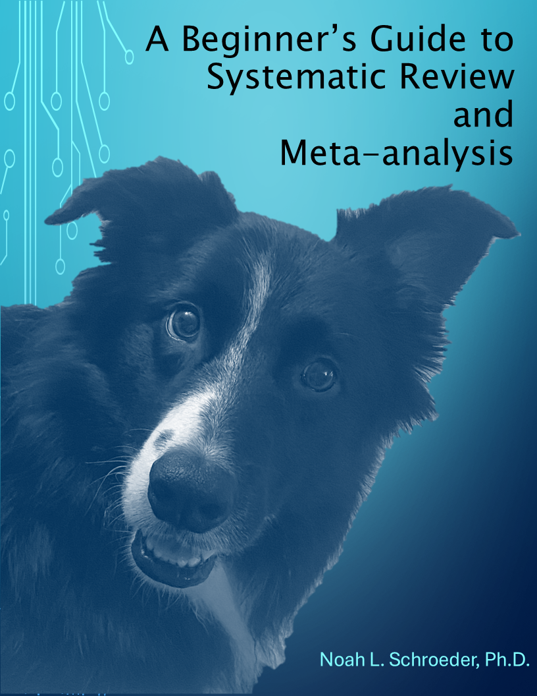

# Welcome {.unnumbered}

{width="50%"}

This book is designed as a fundamental "how-to" guide to help researchers new to systematic review and meta-analysis in education and other fields. [This book is focused on how to execute these methodologies, not the statistics driving specific methods]{.underline}. It is written in a rather informal format in an effort to help a reader connect with the content.

While following the steps in this book can help you run a systematic review or meta-analysis successfully, I highly recommend learning why certain decisions are made. For example, in the meta-analysis section of this book, I assume that you understand what is happening statistically in a meta-analysis. I do not explain the formulas, main ideas, assumptions, etc. in any sort of depth. There are plenty of resources available to help you learn this information, it is simply outside the current scope of this book. [This book is currently a strictly “how-to” guide and I have no intention to make it into what I would consider a "true" statistics book.]{.underline}

**What makes this book different than others?** All meta-analysis examples in this book are using standardized mean difference effect sizes (Hedge's *g*). There are a lot of examples online of meta-analysis in R using correlations, and this book was created, in part, because there were very few resources I could find about how to do meta-analysis with standardized mean differences.

## What standards and packages does this book align with? {.unnumbered}

I provide guidance in relation to the [PRISMA guidelines](http://www.prisma-statement.org/) [@page2021] and we will use [metafor](http://www.metafor-project.org/doku.php/metafor) [@viechtbauer2010] (and other packages) for conducting meta-analyses.

## Who is this book for? {.unnumbered}

This book is designed for:

-   People who are just learning about systematic review and meta-analysis methods.

-   People who understand meta-analysis, but don’t really understand R.

-   People who are used to using graphic user interface (GUI)-based programs for conducting meta-analysis, but want to switch to R.

-   Anyone else who wants to improve their knowledge of systematic review and meta-analytical methods.

My aim with this book is to make systematic review, and particularly meta-analysis, accessible to those who may not fully understand every aspect of R but want to create reproducible analyses, and most of all, enjoy the free nature of R.

## What will you learn? {.unnumbered}

After reading this book, you will be able to:

-   establish research questions and inclusion criteria

-   conduct a well-documented literature search

-   screen abstracts and studies

-   conduct a conventional meta-analysis in R

-   conduct a three-level meta-analysis in R

## Why does this book exist? {.unnumbered}

There are a plethora of resources available to help you learn about meta-analysis. There are even a number of open-access books to help you learn to do meta-analysis in R (I really enjoyed [Doing Meta-Analysis in R: A Hands-On Guide](#0) [@harrer2021] and [Doing Meta-Analysis in R and Exploring Heterogeneity Using Metaforest](#0) [@vanlissa]. You will find that much of the three-level meta-analysis code in this book aligns with these two resources' recommendations).

However, when learning to do meta-analysis in R, I found a lot of examples using correlations, whereas many meta-analyses in the educational sciences use standardized mean difference (SMD) as the effect size. For a non-R user, this change is not as trivial as it sounds because it involves your data structures and the R code. After much trial and error, I finally was able to learn how to do meta-analyses using metafor in R using SMD, as well as run three-level meta-analysis models.

In addition, the transition from GUI-based programs to R was challenging for me because I did not know all of the code associated with R, particularly with [metafor](http://www.metafor-project.org/doku.php/metafor) [@viechtbauer2010]. I enjoy coding, always have, but this was a steep learning curve even for me. Luckily, there are a lot of great resources available online for learning R for free. This is one of the best features of using R – there is so much documentation available to help you learn, and it costs you nothing but time. I hope this book will one of those resources that helps others learn how to use R.

## How to use this book. {.unnumbered}

As you read this book, you will see that I will explain the major steps of whatever process the chapter is about, and then provide the code for the analyses where appropriate. I have commented out the major ideas and pieces throughout the code examples. While this is most certainly not a statistics book, I do highlight nuanced, yet important, statistical issues you need to know about to conduct a meta-analysis in R if you're coming from a GUI-based platform. For example, you will soon see that when you conduct moderator analyses in metafor, there are actually two different Q tests, one which tests if there are significant differences between levels of the moderator, and one that tests if the moderators are significantly different than zero. We’ll take a look at these types of issues throughout this guide.

## Disclaimer. {.unnumbered}

This is a living book, meaning I update it as I have time. Please do not be surprised if information changes or is added. In addition, please consider all code and recommendations in this book exactly that, recommendations. There may be errors and/or the code may not work for your use case. You assume all liability associated with using the code and information provided throughout this book.

If you find errors in the code or text, please email me so I can correct them.

## About the author. {.unnumbered}

My name is Noah Schroeder, I received my Ph.D. from the Educational Psychology program at Washington State University in 2013. I have been involved with systematic review and meta-analysis since 2010. I learned about meta-analysis using GUI-based programs. I taught myself how to use R and metafor using published papers and online resources because I was bored and it seemed like a fun thing to do. I also could not do the analyses I wanted (three-level meta-analysis) in GUI-based programs, but I could run them in R. My areas of expertise are virtual humans and other pedagogical agents, multimedia learning, and of course, review methodologies. Please feel free to visit my [Google Scholar profile](https://scholar.google.com/citations?user=W-Ij6voAAAAJ&hl=en&oi=ao).

```{r include=FALSE}
# automatically create a bib database for R packages
knitr::write_bib(c(
  .packages(), 'bookdown', 'knitr', 'rmarkdown'
), 'packages.bib')
```

---
bibliography: references.bib
---
